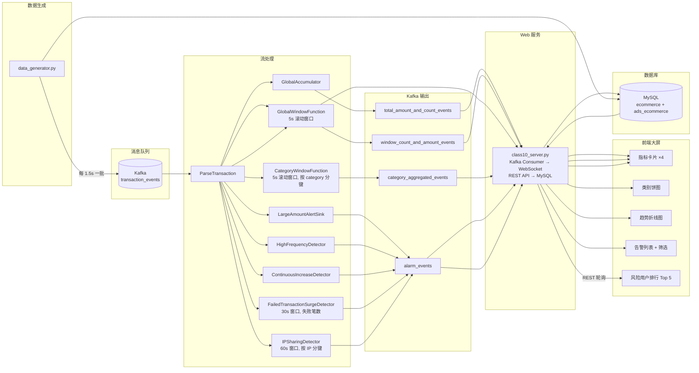

# 电商交易风险检测系统 — 前端数据接口设计文档

> 版本：v2.0 | 更新日期：2026-05-26

---

## 一、实时推送通道（WebSocket ← Kafka）

前端通过 `ws://localhost:8000/ws` 建立 WebSocket 连接，服务端消费 Kafka 后实时广播。每条消息格式统一为：

```json
{ "topic": "<通道名>", "data": { ... } }
```

### 1.1 全局累计统计

| 项目 | 说明 |
|------|------|
| 通道名 | `total_amount_and_count_events` |
| 推送频率 | 每条交易到达时推送（实时累计） |
| 数据源 | Flink `GlobalAccumulator`，自作业启动起持续累加 |

```json
{
  "total_amount": 123456.78,
  "transaction_count": 4221,
  "update_time": "2026-05-26T15:30:00.123456+00:00"
}
```

**前端用途**：顶部指标卡——"实时总交易金额"、"实时总交易笔数"。

---

### 1.2 窗口全量统计

| 项目 | 说明 |
|------|------|
| 通道名 | `window_count_and_amount_events` |
| 推送频率 | 每 5 秒一个窗口 |
| 数据源 | Flink `GlobalWindowFunction`，5 秒滚动窗口聚合全部交易 |

```json
{
  "window_start": 1716543000000,
  "window_end": 1716543005000,
  "total_amount": 5634.20,
  "transaction_count": 87
}
```

> `window_start` / `window_end` 为毫秒级 Unix 时间戳，前端转换为本地时间显示。

**前端用途**：顶部指标卡——"当前窗口金额"；右侧趋势折线图（金额 + 笔数双 Y 轴）。

---

### 1.3 商品类别窗口聚合

| 项目 | 说明 |
|------|------|
| 通道名 | `category_aggregated_events` |
| 推送频率 | 每 5 秒每个类别一条 |
| 数据源 | Flink `CategoryWindowFunction`，按类别分键的 5 秒滚动窗口 |

```json
{
  "window_start": 1716543000000,
  "window_end": 1716543005000,
  "category": "electronics",
  "total_amount": 1200.50,
  "transaction_count": 23
}
```

**前端用途**：左侧饼图——"商品类别交易分布"，展示最近一个窗口内各类别交易额占比。

---

### 1.4 风险告警流

| 项目 | 说明 |
|------|------|
| 通道名 | `alarm_events` |
| 推送频率 | 实时，检测到异常立即发送 |
| 数据源 | Flink 5 路检测算子联合输出 |

共有 **5 种告警类型**，公共字段：

```json
{
  "alert_type": "LARGE_AMOUNT",
  "user_id": "user_abc123",
  "alert_time": "2026-05-26T15:30:01.123456+00:00",
  "details": "..."
}
```

各类型特有字段：

| alert_type | 额外字段 | 触发条件 |
|------------|----------|----------|
| `LARGE_AMOUNT` | `transaction_id`, `amount`, `category` | 单笔金额 > ¥5,000 |
| `HIGH_FREQUENCY` | `transaction_count`, `window_start`, `window_end` | 5 分钟内同用户 ≥ 5 笔 |
| `CONTINUOUS_INCREASE` | `transaction_id`, `amount`, `sequence_length`, `amounts[]` | 连续 ≥ 3 笔递增（每笔增幅 ≥ 10%） |
| `FAILED_SURGE` | `transaction_count`, `window_start`, `window_end` | 30 秒内失败交易 ≥ 8 笔 |
| `IP_SHARING` | `ip_address`, `user_count`, `shared_users[]`, `window_start`, `window_end` | 60 秒内同 IP ≥ 3 个不同用户 |

**前端用途**：告警列表（支持按类型和关键词筛选）、告警总数指标卡。

---

## 二、REST API 接口

Base URL：`http://localhost:8000/api`

### 2.1 基础查询

| 接口 | 方法 | 参数 | 返回 |
|------|------|------|------|
| `/categories` | GET | — | `[{category, description}]` — 10 个商品类别字典 |
| `/stats/history` | GET | `window_start?`, `window_end?` | `[{window_start, window_end, category, total_amount, transaction_count}]` — 默认最近 200 条 |

### 2.2 告警查询

| 接口 | 方法 | 参数 | 返回 |
|------|------|------|------|
| `/alerts/history` | GET | `alert_type?`, `keyword?`, `limit?`（默认 500） | `[{alert_type, user_id, transaction_id, amount, transaction_count, details, alert_time}]` |
| `/alerts/stats` | GET | — | `{by_type: [{alert_type, count}], by_hour: [{hour, count}]}` |
| `/top-risky-users` | GET | `limit?`（默认 5） | `[{user_id, user_name, alert_count}]` — 按告警次数降序 |

### 2.3 筛选逻辑

前端告警列表的"筛选"按钮调用 `/alerts/history`：

- `alert_type` —— 对应下拉框选项，空值表示全部类型
- `keyword` —— 同时对 `user_id`、`transaction_id`、`details` 三列做模糊匹配
- 有筛选条件时 `filterActive = true`，WebSocket 新到达的告警不会覆盖筛选结果
- 清空筛选条件并再次点击按钮后恢复实时推送列表

---

## 三、数据流架构



## 四、数据库表结构

### ecommerce 库（ODS/DWD 层）

| 表 | 关键字段 | 用途 |
|----|----------|------|
| `categories` | `category`, `description` | 商品类别字典 |
| `users` | `user_id`, `user_name`, `ip_address`, `account_type`, `device` | 用户基本信息（300 用户，30 个共享 IP 池） |
| `products` | `product_id`, `category`, `product_name`, `price`, `status` | 商品目录（每类 6~12 个，按类别分价格档位） |
| `transactions` | `transaction_id`, `user_id`, `product_id`, `category`, `amount`, `transaction_type`, `result`, `event_time` | 交易事实表（数据生成器持续写入） |

### ads_ecommerce 库（ADS 层）

| 表 | 关键字段 | 用途 |
|----|----------|------|
| `transaction_stats` | `window_start`, `window_end`, `category`, `total_amount`, `transaction_count` | Flink 窗口聚合结果 |
| `risk_alerts` | `alert_type`, `user_id`, `transaction_id`, `amount`, `transaction_count`, `window_start`, `window_end`, `details`, `alert_time` | 5 类风险告警记录 |
