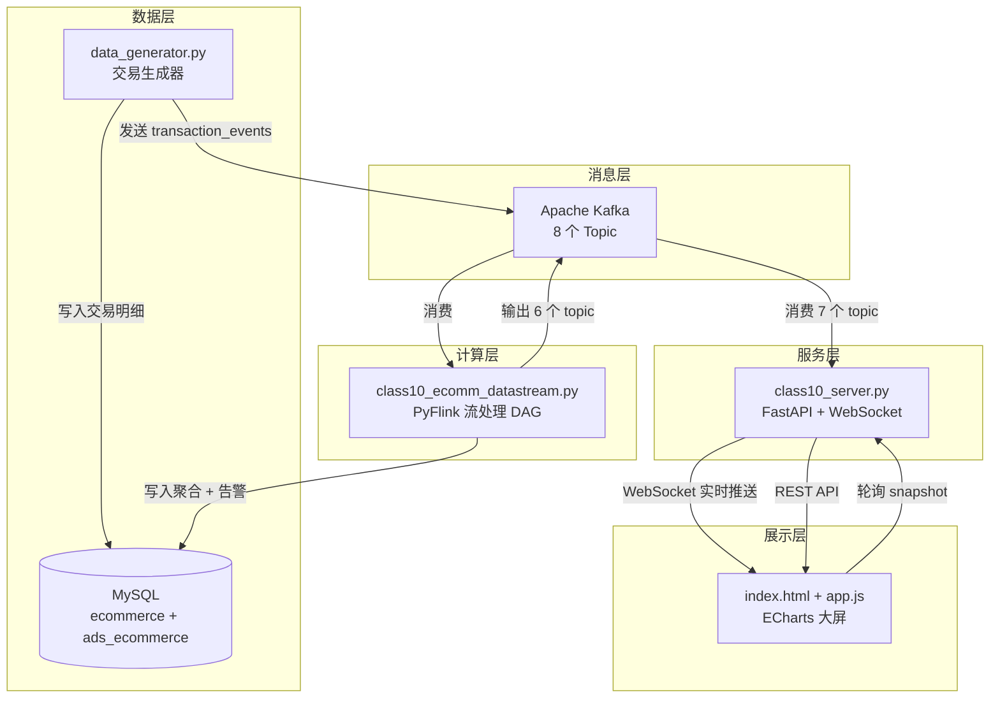
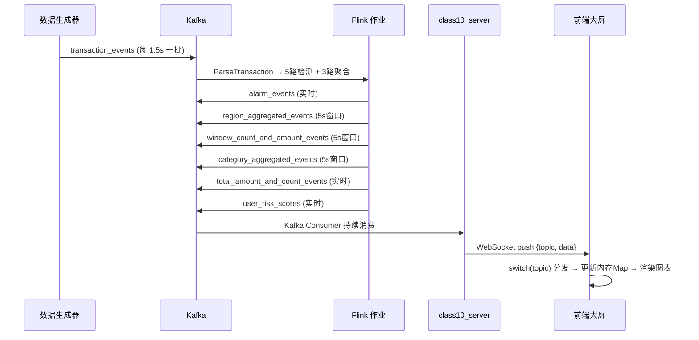
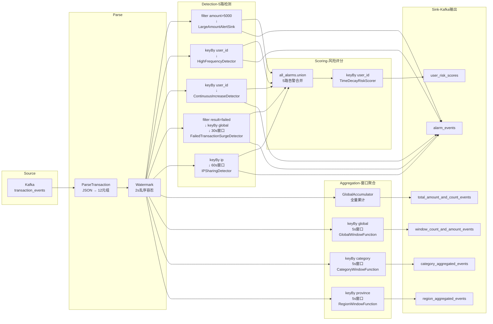

# 电商交易风险实时检测系统 — 技术文档

> **项目定位**：基于 PyFlink + Kafka + FastAPI + ECharts 的实时流处理教学演示系统，模拟电商交易场景下的多维度风险检测与大屏可视化。

---

## 一、项目概述

### 1.1 项目背景与目标

电子商务平台每天产生海量交易数据，欺诈行为（盗刷、刷单、账号共享）隐藏在正常交易流中，需要毫秒级识别和响应。传统批处理方案（T+1 报表）无法满足实时风控需求。

本系统构建了一条完整的实时流处理管道：**模拟交易数据 → Kafka 消息队列 → Flink 流计算 → WebSocket 实时推送 → 大屏可视化**，在一张监控大屏上同时展示交易全景与风险态势。

### 1.2 技术选型与理由

| 组件 | 选型 | 理由 |
|------|------|------|
| 流处理引擎 | Apache Flink (PyFlink 1.18) | 真正事件时间语义、有状态处理、毫秒级延迟，优于 Spark Streaming 微批模型 |
| 消息队列 | Apache Kafka 2.12 | 高吞吐、持久化、发布-订阅模型天然解耦生产与消费 |
| Web 框架 | FastAPI + Uvicorn | 原生 WebSocket 支持、异步非阻塞、自动 OpenAPI 文档 |
| 实时推送 | WebSocket | 全双工长连接，单条消息延迟 < 10ms，远优于 HTTP 轮询 |
| 可视化 | ECharts 5.x | 原生 geo 组件支持中国地图、gauge 仪表盘、丰富的暗色主题定制能力 |
| 数据生成 | Faker + 自定义逻辑 | 可控的概率模型注入异常，同时写入 MySQL 和 Kafka |
| 数据库 | MySQL 8.x | 双库设计（DWD 层 ecommerce + ADS 层 ads_ecommerce），模拟数仓分层 |

### 1.3 系统能力一览

**风险检测**：5 路并行检测算子覆盖大额交易、高频交易、连续递增、失败飙升、IP 共用五类欺诈模式，检出结果秒级推送大屏。

**风险评分**：基于指数时间衰减的动态评分模型，每条告警的严重性随具体指标（金额、次数）线性放大并设上界，分用户累计形成 Top 10 排行榜。

**多维聚合**：5 秒滚动窗口按全局、商品类别、省份三个维度聚合交易金额与笔数，结果双写 Kafka（供实时推送）和 MySQL（供历史查询）。

**地理可视化**：中国地图热力图支持交易金额 / 风险告警双模式切换，省份数据来自 Flink 实时聚合和 MySQL 历史查询。

**可靠性设计**：Kafka 消费者自动重连、WebSocket 断线指数退避重连、浏览器刷新后累计状态不丢失。

---

## 二、需求分析

### 2.1 功能需求

#### 2.1.1 交易数据模拟

系统需要在不依赖真实电商接口的条件下产生有意义的测试数据。

- **用户模型**：300 个用户，分配至 31 个中国大陆省级行政区（按人口权重加权随机），共享 30 个 IP 地址池（有限复用触发 IP 共用检测），每个用户拥有设备指纹和账户类型（普通/VIP）。
- **商品模型**：10 个商品类别（电子、服装、食品、家居、图书、运动、玩具、健康、汽车、音乐），每类 6~12 个 SKU，价格区间贴合实际（电子产品 50~5000 元，食品 1~100 元）。
- **异常注入**：每批 15 条交易中按独立概率注入三种异常——25% 概率注入高频交易（同用户连续 3~5 笔）、15% 概率注入连续递增（1~2 个用户各 3~4 笔）、25% 概率注入大额交易（1~2 笔金额 5000~20000 元）。
- **双路输出**：交易明细同步写入 MySQL ecommerce.transactions 表（DWD 层持久化）和 Kafka transaction_events 主题（实时流处理入口）。

#### 2.1.2 风险检测规则

系统需对每笔交易实时评估，当满足以下任一条件时生成告警：

| 编号 | 告警类型 | 触发条件 | 检测窗口 | 状态管理 |
|------|---------|---------|---------|---------|
| R1 | 大额交易 (LARGE_AMOUNT) | 单笔交易金额 > ¥5,000 | 无窗口（逐笔判断） | 无状态 |
| R2 | 高频交易 (HIGH_FREQUENCY) | 同一用户 5 分钟内交易 ≥ 5 笔 | 5 分钟滑动窗口 | ListState<Long> 存储时间戳 + Timer 清理 |
| R3 | 连续递增 (CONTINUOUS_INCREASE) | 连续 ≥ 3 笔金额逐笔递增，每笔增幅 ≥ 10% | 无窗口（序列检测） | ListState<Double> 存储最近 10 笔金额 |
| R4 | 失败飙升 (FAILED_SURGE) | 30 秒内失败交易 ≥ 8 笔 | 30 秒滚动窗口 | ProcessWindowFunction 窗口内计数 |
| R5 | IP 共用 (IP_SHARING) | 60 秒内同一 IP ≥ 3 个不同用户 | 60 秒滚动窗口 | ProcessWindowFunction 窗口内去重计数 |

#### 2.1.3 风险评分模型

在五路检测之上，系统维护每个用户的**时间衰减风险评分**，综合反映用户近期风险行为的频率和严重程度。评分每收到一条告警即更新，通过指数衰减函数使旧风险随时间减弱，新风险立即反映。

#### 2.1.4 大屏可视化

| 区域 | 图表类型 | 数据来源 | 刷新频率 |
|------|---------|---------|---------|
| 顶部指标卡 ×4 | 数字卡片 | WebSocket 实时推送 | 每笔交易 / 每 5 秒 |
| 用户风险评分 Top 10 | 横向柱状图 | 轮询 + WebSocket 触发 | 15 秒 / 实时触发 |
| 风险用户排行 Top 5 | 排名列表 | 轮询 | 15 秒 |
| 告警仪表盘 2×3 | 6 个 Gauge | 轮询 | 15 秒 |
| 商品类别交易分布 | 环形饼图 | WebSocket 实时推送 | ~5 秒 |
| 近 5 分钟交易趋势 | 双 Y 轴折线图 | WebSocket 实时推送 | ~5 秒 |
| 中国地图热力图 | Geo Map | WebSocket + 轮询 | ~5 秒 / 15 秒 |
| 实时告警列表 | 可筛选表格 | WebSocket + REST | 实时 / 手动筛选 |

#### 2.1.5 数据导出

- 告警导出：支持按类型和关键词筛选后导出 CSV（BOM 头确保 Excel 中文兼容）
- 统计导出：支持按时间窗口范围导出交易统计数据

### 2.2 非功能需求

| 类别 | 需求 | 实现方式 |
|------|------|---------|
| 低延迟 | 交易→大屏 < 2 秒 | Kafka + WebSocket 全链路推送，无轮询环节 |
| 状态持久化 | 浏览器刷新后数据不丢失 | Server 端维护累计状态，新连接时发送快照 |
| 容错性 | Kafka/MySQL 异常自动恢复 | Kafka 消费者 while True 重连；API 层 try/except 返回 error JSON |
| 可配置性 | 密码和路径不硬编码 | mysql_config.json + 环境变量 MYSQL_PASSWORD / PYFLINK_VENV |
| 可测试性 | 核心逻辑独立可测 | 算法与框架解耦，mock 外部依赖即可运行 |

---

## 三、系统总体设计

### 3.1 分层架构

系统按数据流向自底向上分为四层：



### 3.2 数据流详解

#### 3.2.1 实时链路（交易 → 大屏，秒级）



#### 3.2.2 轮询链路（历史统计，15 秒级）

```
前端 fetchSnapshot() → GET /api/dashboard/snapshot
  → Server 打开 1 个 MySQL 连接
    → _query_top_risky_users(cur, 5)      → [跨库JOIN或fallback分步查询]
    → _query_alert_type_distribution(cur)  → [GROUP BY alert_type]
    → _query_region_alerts(cur)            → [JOIN users.province]
  → Server 关闭连接
  → _query_risk_scores(10)                 → [读内存risk_score_cache + JOIN用户名]
  → 合并为 1 个 JSON 返回前端
```

### 3.3 数据库设计

#### 3.3.1 分层策略

| 层级 | 数据库 | 用途 | 写入方 |
|------|--------|------|--------|
| DWD（明细层） | ecommerce | 维度表 + 交易事实表 | data_generator |
| ADS（应用层） | ads_ecommerce | 窗口聚合 + 风险告警 | Flink 作业 |

#### 3.3.2 ecommerce 库（DWD 层）

**categories** — 商品类别字典

| 字段 | 类型 | 约束 | 说明 |
|------|------|------|------|
| category | VARCHAR(50) | PK | 类别名称（electronics, clothing, ...） |
| description | VARCHAR(200) | NULL | 类别描述 |

**users** — 用户信息表

| 字段 | 类型 | 约束 | 说明 |
|------|------|------|------|
| user_id | VARCHAR(50) | PK | 用户唯一标识 |
| user_name | VARCHAR(100) | NOT NULL | 用户名 |
| ip_address | VARCHAR(45) | NULL | 客户端 IP（30 个池中选取） |
| province | VARCHAR(30) | NULL, INDEX | 省份（31 个省级行政区） |
| city | VARCHAR(30) | NULL | 城市 |
| account_type | VARCHAR(20) | DEFAULT 'normal' | normal / vip |
| device | VARCHAR(200) | NULL | 登录设备 |

**products** — 商品信息表

| 字段 | 类型 | 约束 |
|------|------|------|
| product_id | VARCHAR(50) | PK |
| category | VARCHAR(50) | NOT NULL, FK → categories |
| product_name | VARCHAR(200) | NULL |
| price | DECIMAL(10,2) | NOT NULL |
| status | VARCHAR(20) | DEFAULT 'active' |

**transactions** — 交易事实表

| 字段 | 类型 | 约束 | 说明 |
|------|------|------|------|
| transaction_id | VARCHAR(50) | PK | 交易唯一标识 |
| user_id | VARCHAR(50) | NOT NULL, FK → users | 用户 |
| product_id | VARCHAR(50) | NULL, FK → products | 商品（可为空） |
| category | VARCHAR(50) | NOT NULL | 类别 |
| amount | DECIMAL(12,2) | NOT NULL | 金额 |
| transaction_type | VARCHAR(20) | DEFAULT 'purchase' | purchase / refund / transfer |
| result | VARCHAR(20) | DEFAULT 'success' | success / failed / processing |
| event_time | TIMESTAMP(3) | NOT NULL, INDEX | 业务事件时间（毫秒精度） |

#### 3.3.3 ads_ecommerce 库（ADS 层）

**transaction_stats** — 窗口聚合表

| 字段 | 类型 | 约束 | 说明 |
|------|------|------|------|
| id | BIGINT | PK AUTO_INCREMENT | 自增主键 |
| window_start | TIMESTAMP(3) | NOT NULL, UNIQUE KEY | 窗口起始 |
| window_end | TIMESTAMP(3) | NOT NULL, UNIQUE KEY | 窗口结束 |
| category | VARCHAR(50) | NOT NULL, UNIQUE KEY | 类别（ALL=全局） |
| total_amount | DECIMAL(14,2) | NOT NULL | 窗口内总金额 |
| transaction_count | BIGINT | NOT NULL | 窗口内交易笔数 |

唯一约束 `(window_start, window_end, category)` 配合 `ON DUPLICATE KEY UPDATE` 实现 UPSERT。

**risk_alerts** — 风险告警表

| 字段 | 类型 | 约束 | 说明 |
|------|------|------|------|
| alert_id | BIGINT | PK AUTO_INCREMENT | 自增告警 ID |
| alert_type | VARCHAR(50) | NOT NULL, INDEX | 告警类型（5 种） |
| user_id | VARCHAR(50) | NOT NULL, INDEX | 涉及用户 |
| transaction_id | VARCHAR(50) | NULL, INDEX | 触发交易 |
| amount | DECIMAL(12,2) | NULL | 涉及金额（仅大额和递增） |
| transaction_count | INT | NULL | 交易次数（仅高频和失败飙升） |
| window_start | TIMESTAMP(3) | NULL | 窗口起始（仅基于窗口的检测） |
| window_end | TIMESTAMP(3) | NULL | 窗口结束 |
| details | TEXT | NULL | 详细信息 |
| alert_time | TIMESTAMP(3) | NOT NULL, INDEX | 告警时间 |

### 3.4 Kafka Topic 体系

| Topic | 生产者 | 消费者 | 消息关键字段 |
|-------|--------|--------|-------------|
| `transaction_events` | data_generator | Flink | user_id, amount, category, timestamp, province, ip_address... |
| `alarm_events` | Flink (5路union) | class10_server | alert_type, user_id, amount/count, alert_time |
| `total_amount_and_count_events` | Flink GlobalAccumulator | class10_server | total_amount, transaction_count |
| `window_count_and_amount_events` | Flink GlobalWindowFunction | class10_server | window_start, total_amount, transaction_count |
| `category_aggregated_events` | Flink CategoryWindowFunction | class10_server | category, total_amount, transaction_count |
| `region_aggregated_events` | Flink RegionWindowFunction | class10_server | province, total_amount, transaction_count |
| `user_risk_scores` | Flink TimeDecayRiskScorer | class10_server | user_id, risk_score |

---

## 四、功能模块详细设计

### 4.1 数据生成模块 (data_generator.py, 321 行)

#### 4.1.1 生成策略

**批量生成循环**：

```
每 1.5 秒生成 1 批（15 条交易），10 分钟后自动停止
  ├── 25% 概率：随机选 1 个用户，连续生成 3~5 笔交易（高频注入）
  ├── 15% 概率：随机选 1~2 个用户，各生成 3~4 笔递增金额交易
  ├── 25% 概率：生成 1~2 笔金额 5000~20000 的大额交易
  └── 填充槽位：随机生成普通交易至 15 条
```

**普通交易规则**：
- 用户随机选取
- 商品随机选取（单价 10~3000 元）
- 类型分布：80% purchase, 12% refund, 8% transfer
- 结果分布：80% success, 12% failed, 8% processing
- 事件时间：当前时间 ± 5 秒随机偏移

**连续递增交易**（同用户多笔）：
- 第一笔金额 10~200 元随机
- 后续每笔 = 前一笔 × [1.1, 1.5] 随机倍数
- 状态管理：`seq_states` 字典记录每个用户最后一次金额和计数，`seq_committed` 集合防止同批次重复注入同一用户

#### 4.1.2 双路输出

**MySQL 写入**：批量 `executemany` INSERT，主键冲突时逐条回退重试。遇到连接断开通过 `conn.ping(reconnect=True)` 最多 3 次重连。

**Kafka 发送**：逐条异步 `producer.send()`，最后 `flush()` 确保批次完整送达。每条消息包含 12 个字段：transaction_id, user_id, product_id, category, amount, transaction_type, result, ip_address, product_name, province, city, timestamp（毫秒级 epoch）。

### 4.2 Flink 流处理模块 (class10_ecomm_datastream.py, 743 行)

这是系统的核心计算层。Flink 作业从 Kafka 消费原始交易 JSON，经过解析、分叉、检测、聚合后输出结果。

#### 4.2.1 作业拓扑总览



#### 4.2.2 数据解析层

**ParseTransaction**（MapFunction）：将 Kafka 中的 JSON 字符串解析为 12 元组结构。

```python
return (
    txn["user_id"],                          # T_IDX_USER_ID    = 0
    float(txn["amount"]),                    # T_IDX_AMOUNT     = 1
    txn.get("category", "unknown"),          # T_IDX_CATEGORY   = 2
    int(txn["timestamp"]),                   # T_IDX_TIMESTAMP  = 3
    txn["transaction_id"],                   # T_IDX_TXN_ID     = 4
    txn.get("result", "success"),            # T_IDX_RESULT     = 5
    txn.get("transaction_type", "purchase"), # T_IDX_TXN_TYPE   = 6
    txn.get("ip_address", "0.0.0.0"),        # T_IDX_IP_ADDRESS = 7
    txn.get("product_id", "unknown"),        # T_IDX_PRODUCT_ID = 8
    txn.get("product_name", "unknown"),      # T_IDX_PRODUCT_NAME = 9
    txn.get("province", "未知"),              # T_IDX_PROVINCE   = 10
    txn.get("city", "未知"),                  # T_IDX_CITY       = 11
)
```

**设计要点**：
- 必填字段（user_id, amount, timestamp, transaction_id）直接取，缺失抛异常
- 可选字段（category, ip_address, province 等）使用 `.get()` 提供默认值，保障数据管道不会因字段缺失中断
- 12 个字段索引通过模块级常量 `T_IDX_USER_ID` ~ `T_IDX_CITY` 引用，消除魔术数字。下游 15 处 key_by/filter/function 均使用常量而非裸数字

**时间语义**：使用 `TransactionTimestampAssigner` 从元组索引 3 提取事件时间戳（毫秒 epoch），配置 2 秒乱序容忍度的 BoundedOutOfOrderness Watermark。

#### 4.2.3 五路检测算子

##### (1) 大额交易检测 — LargeAmountAlertSink

**类型**：MapFunction（无状态）

**逻辑**：`filter(lambda t: t[T_IDX_AMOUNT] > 5000.0)` 过滤后直接构造告警 JSON。

```
触发条件：amount > HIGH_AMOUNT_THRESHOLD (5000.0)
告警字段：alert_type, user_id, transaction_id, amount, category, alert_time, details
```

MySQL 持久化在 map 函数内完成：通过 `open()` 中建立的 pymysql 连接写入 risk_alerts 表。

##### (2) 高频交易检测 — HighFrequencyDetector

**类型**：KeyedProcessFunction（按 user_id 分组，有状态 + 定时器）

**状态管理**：`ListState<Long>` 存储该用户当前窗口内所有交易的时间戳（毫秒 epoch）。

**处理流程**：

```
process_element(value, ctx):
  1. 从 ListState 读取历史时间戳列表
  2. 过滤：丢弃 5 分钟前的记录 (cutoff = ts - 300000ms)
  3. 追加当前时间戳
  4. 注册定时器：ts + 300000ms 触发 on_timer 清理
  5. 如果列表长度 >= FREQ_THRESHOLD(5) → 输出告警

on_timer(timestamp, ctx):
  1. 读取 ListState，过滤已过期的记录
  2. 写回过滤后的列表
  3. 返回 []（不输出任何数据，仅清理）
```

**设计要点**：
- 定时器确保过期时间戳被清理，防止状态无限增长
- 第 5 笔即触发告警，不等待窗口关闭——实现实时检出
- 注意 `on_timer` 必须显式返回空列表 `[]`，不能返回 `None`（PyFlink 对 None 视为异常）

##### (3) 连续递增检测 — ContinuousIncreaseDetector

**类型**：KeyedProcessFunction（按 user_id 分组，有状态）

**状态管理**：`ListState<Double>` 存储该用户最近 10 笔交易金额。

**检测算法**（反向扫描）：

```
process_element(value, ctx):
  1. 从 ListState 读取历史金额列表
  2. 追加当前金额
  3. 如果列表长度 > 10，截断保留最近 10 笔
  4. 如果长度 >= INCREASE_MIN_SEQ(3):
     a. 从最新金额开始，反向扫描列表
     b. 检查 amounts[i+1] >= amounts[i] × INCREASE_FACTOR(1.1)
     c. 连续满足则 inc_count++，不满足则中断
     d. 如果 inc_count >= 3 → 输出告警 → 清空 ListState（防止重复触发）
```

**实例分析**：用户交易序列 [100, 120, 95, 150, 200]

| 步骤 | 当前金额 | 状态列表 | 扫描结果 |
|------|---------|---------|---------|
| t1 | 100 | [100] | len=1，不检测 |
| t2 | 120 | [100, 120] | len=2，不检测 |
| t3 | 95 | [100, 120, 95] | 95 >= 120×1.1? No → inc_count=1，不触发 |
| t4 | 150 | [100, 120, 95, 150] | 150 >= 95×1.1? Yes → 95 >= 120×1.1? No → inc_count=2 |
| t5 | 200 | [100, 120, 95, 150, 200] | 200 >= 150×1.1? Yes → 150 >= 95×1.1? Yes → 95 >= 120×1.1? No → inc_count=3 → **触发告警** |

##### (4) 失败交易飙升检测 — FailedTransactionSurgeDetector

**类型**：ProcessWindowFunction（30 秒滚动窗口，按 global key 聚合）

**逻辑**：`filter(result == "failed") → key_by("global") → 30s窗口 → process`

窗口关闭时统计失败交易总数，如果 >= FAILED_SURGE_THRESHOLD(8) 则输出告警。

**告警字段**：alert_type, user_id="GLOBAL", transaction_count, window_start/end, alert_time。

##### (5) IP 共用检测 — IPSharingDetector

**类型**：ProcessWindowFunction（60 秒滚动窗口，按 ip_address 分组）

**逻辑**：`key_by(ip_address) → 60s窗口 → process`

窗口内收集所有 user_id 并去重计数。同一 IP 出现 >= IP_SHARING_THRESHOLD(3) 个不同用户时告警。

**告警字段**：alert_type, user_id（取第一个用户）, ip_address, user_count, shared_users 列表, window_start/end。

#### 4.2.4 时间衰减风险评分模型

这是本项目模型设计的核心。在五路规则检测之上，为每个用户维护一个**动态风险评分**，综合反映其近期风险行为的频率和严重性。

##### 模型设计动机

五路检测各自独立工作，产生的是离散的告警事件。但实际业务需要回答："谁是最危险的用户？"这需要：

1. **跨类型整合**：大额交易和高频交易的风险性质不同，但需要统一量化
2. **时间敏感性**：昨天的大额交易不如 1 分钟前的高频交易更值得关注
3. **严重性区分**：50000 元的交易比 5001 元更可疑，20 笔高频交易比刚好 5 笔更可疑

##### 模型架构

评分模型包含两个层次：

**第一层：严重性函数 `S(a)`** — 将单条告警映射为一个严重性分数。

$$\text{severity} = w_{\text{base}} \times m_{\text{dynamic}}$$

其中：
- $w_{\text{base}}$ 为基础权重，反映告警类型的相对严重性
- $m_{\text{dynamic}}$ 为动态乘数，基于告警具体指标超出阈值的程度

**第二层：时间衰减累加** — 将严重性分数按指数衰减后累加到用户总分。

$$R_{\text{new}} = R_{\text{old}} \times e^{-\lambda \cdot \Delta t} + S(a_{\text{new}})$$

其中：
- $R_{\text{old}}$ 为用户上次告警后的评分
- $\Delta t$ 为距离上次告警的时间差（毫秒）
- $\lambda$ 为衰减系数，由半衰期参数推导

##### 参数设置

| 参数 | 值 | 推导 |
|------|------|------|
| 半衰期 $T_{1/2}$ | 3 分钟 = 180,000 毫秒 | 演示场景适配：前 3 分钟积累，后 7 分钟衰减 |
| 衰减系数 $\lambda$ | $\ln(2) / 180000 \approx 3.85 \times 10^{-6}$ | $\lambda = \ln(2) / T_{1/2}$ |
| 衰减函数 | $e^{-\lambda \cdot \Delta t}$ | $\Delta t = 0$ 时 $e^0 = 1$（无衰减）；$\Delta t = T_{1/2}$ 时 $e^{-\ln(2)} = 0.5$（减半） |

##### 基础权重配置

| 告警类型 | 基础权重 $w_{\text{base}}$ | 设计依据 |
|----------|--------------------------|---------|
| LARGE_AMOUNT | 0.30 | 直接资金损失，危害最大 |
| HIGH_FREQUENCY | 0.25 | 高频操作表征自动化攻击 |
| CONTINUOUS_INCREASE | 0.20 | 试探性递增是典型的欺诈前奏 |
| FAILED_SURGE | 0.25 | 批量失败表征撞库或卡号测试 |
| IP_SHARING | 0.25 | 多账户共用 IP 是账号共享/团伙特征 |

##### 动态乘数函数

动态乘数 $m_{\text{dynamic}}$ 针对每种告警类型分别定义，将实际指标值映射为乘数，范围 $[1.0, \text{cap}]$：

| 告警类型 | 指标 | 阈值 | 乘数公式 | 上限 |
|----------|------|------|---------|------|
| LARGE_AMOUNT | amount（交易金额） | 5,000 | $m = \min(amount / 5000,\ 5.0)$ | 5x |
| HIGH_FREQUENCY | transaction_count（交易笔数） | 5 | $m = \min(count / 5,\ 4.0)$ | 4x |
| CONTINUOUS_INCREASE | sequence_length（递增长度） | 3 | $m = \min(seq\_len / 3,\ 4.0)$ | 4x |
| FAILED_SURGE | transaction_count（失败笔数） | 8 | $m = \min(count / 8,\ 5.0)$ | 5x |
| IP_SHARING | user_count（共用用户数） | 3 | $m = \min(users / 3,\ 5.0)$ | 5x |

**乘数下界保护**：当指标值为 0 或缺失时（异常数据），$m$ 下限为 1.0，确保至少获得基础权重。

$$m_{\text{final}} = \max(\min(\text{value} / \text{threshold},\ \text{cap}),\ 1.0)$$

**计算示例**：

| 场景 | 输入 | 乘数计算 | 严重性 |
|------|------|---------|--------|
| 大额 5000 元（刚好触发） | amount=5000 | min(5000/5000, 5.0) = 1.0 | 0.30 × 1.0 = **0.30** |
| 大额 25000 元（5 倍阈值，触及上限） | amount=25000 | min(25000/5000, 5.0) = 5.0 | 0.30 × 5.0 = **1.50** |
| 高频 10 笔（2 倍阈值） | count=10 | min(10/5, 4.0) = 2.0 | 0.25 × 2.0 = **0.50** |
| 失败 40 笔（5 倍阈值，触及上限） | count=40 | min(40/8, 5.0) = 5.0 | 0.25 × 5.0 = **1.25** |
| 未知类型 | — | m = 1.0（默认） | 0.10 × 1.0 = **0.10** |

##### 完整计算流程

```
process_element(alert_json, ctx):
  1. 解析告警 JSON，提取 alert_type 和各项指标
  2. 调用 _compute_severity(alert) → severity
  3. 解析 alert_time（毫秒 epoch）：
     - 优先取 alert.alert_time 字段
     - 缺失时回退到 ctx.timestamp()（处理时间）
  4. 从 ValueState 读取上次状态："{score},{timestamp}"
     - 无历史 → score=0, ts=0
  5. 如果 ts > 0 且 now > ts：
     score = score × e^(-λ × (now - ts))  ← 时间衰减
  6. score = score + severity                 ← 累加新严重性
  7. 更新 ValueState ← "{new_score},{now}"
  8. 如果 score > 0.001 → 输出 JSON 到 Kafka
```

##### 状态存储格式

使用 `ValueState<String>` 存储 `"score,timestamp"` 字符串对。选择字符串序列化而非 PyFlink Tuple 类型的原因是：PyFlink 对复合类型的序列化在不同运行模式下表现不一致，字符串方案简单可靠，且本系统并行度为 1，无分布式一致性问题。

##### 模型特性总结

- **时间局部性**：半衰期机制使旧风险随时间指数衰减，1 个半衰期后权重减半，6 个半衰期（18 分钟）后降至 1.6% 以下
- **严重性区分**：动态乘数使 50000 元交易的贡献是 5000 元的 5 倍
- **跨类型可比**：不同告警类型通过归一化参数映射到同一评分空间
- **上界控制**：乘数封顶防止单次极度异常（如 100 万元的交易）主导评分

#### 4.2.5 窗口聚合算子

**GlobalAccumulator**（MapFunction，无窗口）：维护内部 `total` 和 `count` 累加器，每条交易到达即输出当前累计值。这是大屏"实时总交易金额"和"实时总交易笔数"的数据源。

**GlobalWindowFunction**（5 秒滚动窗口，key="global"）：聚合全量交易，结果写入 Kafka 和 MySQL。这是"近 5 秒窗口金额"指标卡和趋势折线图的数据源。

**CategoryWindowFunction**（5 秒滚动窗口，key=category）：按商品类别聚合。这是类别饼图的数据源。

**RegionWindowFunction**（5 秒滚动窗口，key=province）：按省份聚合。这是中国地图热力图（交易金额模式）的数据源。

三个窗口函数的聚合逻辑一致：
```
for each element in window:
    total += element[T_IDX_AMOUNT]
    count += 1
output: {window_start, window_end, key, total_amount, transaction_count}
```

### 4.3 Web 服务模块 (class10_server.py, 533 行)

#### 4.3.1 Kafka 消费者线程

```
kafka_consumer_thread(loop):
  while True:                          ← 外层循环保证断连自动重连
    try:
      consumer = KafkaConsumer(7个topic)
      for msg in consumer:
        payload = {topic, data}
        asyncio.run_coroutine_threadsafe(broadcast(payload), loop)
        
        # 同时维护服务端累计状态（供刷新恢复）
        if topic == "total_amount_and_count_events":
            更新 server_total_amount, server_total_count
        elif topic == "alarm_events":
            server_alarm_count += 1
        elif topic == "region_aggregated_events":
            更新 region_cache（有锁保护）
        elif topic == "user_risk_scores":
            更新 risk_score_cache（有锁保护）
    except Exception:
      logging.warning(...)
      if consumer: consumer.close()
      sleep(5)                        ← 5 秒后重试
```

**线程安全设计**：
- `broadcast()` 是 async 函数，通过 `asyncio.run_coroutine_threadsafe` 从同步线程调度到主事件循环
- `region_cache` 和 `risk_score_cache` 各有独立 Lock 保护
- `server_total_*` 变量由 `server_total_lock` 保护

#### 4.3.2 REST API 端点一览

| 端点 | 方法 | 参数 | 数据源 | 用途 |
|------|------|------|--------|------|
| `/api/categories` | GET | — | MySQL ecommerce | 商品类别字典 |
| `/api/alerts/history` | GET | alert_type?, keyword?, limit? | MySQL ads_ecommerce | 告警历史（支持筛选） |
| `/api/alerts/stats` | GET | — | MySQL ads_ecommerce | 告警类型分布 + 按小时统计 |
| `/api/top-risky-users` | GET | limit? | MySQL (跨库 JOIN) | 告警次数 Top N |
| `/api/dashboard/snapshot` | GET | — | MySQL + 内存缓存 | 合并轮询（Top5+评分+统计+省份） |
| `/api/region-stats` | GET | — | 内存 region_cache | 省份实时交易 |
| `/api/region-alert-stats` | GET | — | MySQL (跨库 JOIN) | 省份告警数量 |
| `/api/user-risk-scores` | GET | limit? | 内存 risk_score_cache + MySQL JOIN | Flink 实时风险评分 |
| `/api/export/alerts` | GET | alert_type?, keyword? | MySQL | CSV 导出（BOM + utf-8-sig） |
| `/api/export/stats` | GET | window_start?, window_end? | MySQL | CSV 导出 |
| `/api/stats/history` | GET | window_start?, window_end? | MySQL | 历史窗口统计 |

**辅助函数复用**：4 个核心查询逻辑（`_query_top_risky_users`、`_query_alert_type_distribution`、`_query_region_alerts`、`_query_risk_scores`）提取为模块级函数，被单端点（如 `/api/top-risky-users`）和合并端点（`/api/dashboard/snapshot`）共同调用，消除重复。

#### 4.3.3 状态快照机制

**问题**：浏览器刷新 → WebSocket 断开 → 重新连接 → `totalAmount` 等前端变量归零。

**方案**：服务端在 Kafka 消费者线程中持续跟踪累计值。当新 WebSocket 客户端连接时，立即发送一条 `{topic: "snapshot", data: {...}}` 消息：

```json
{
  "topic": "snapshot",
  "data": {
    "total_amount": 123456.78,
    "total_count": 4221,
    "alarm_count": 87,
    "region_map": {
      "广东省": {"province": "广东省", "total_amount": 5000.0, "transaction_count": 20}
    }
  }
}
```

前端 `applySnapshot()` 恢复指标卡数值和地图缓存数据。轮询的 `fetchSnapshot()` 则负责恢复历史统计（Top5、告警分布等）。

### 4.4 前端大屏模块 (index.html + app.js + style.css, 838 行)

#### 4.4.1 布局设计

```
┌─────────────────────────────────────────────────┐
│         电商交易风险监控大屏 (42px, 金色)          │
├──────────┬──────────┬──────────┬────────────────┤
│ 总交易金额 │ 总交易笔数 │  告警总数  │ 近5秒交易金额   │  ← 4 指标卡
├──────────┴──────────┴──────────┴────────────────┤
│  用户风险评分 Top 10  │ Top 5 排行  │ 6 个仪表盘   │  ← 三列 2:1:1.8
│  (横向柱状图, 300px)  │ (排名列表)  │ (2×3 grid)  │
├──────────────────────┴─────────────┴─────────────┤
│  商品类别交易分布(饼图)  │  近5分钟交易趋势(折线)  │  ← 两列 1:1
├─────────────────────────────────────────────────┤
│  🌏 全国交易与风险分布 [交易金额|风险告警] 切换    │
│  (ECharts geo map, 650px)                       │
├─────────────────────────────────────────────────┤
│  实时告警列表 [搜索框] [类型筛选] [筛选] [导出CSV] │
│  (可滚动表格, 320px, 粘性表头)                     │
└─────────────────────────────────────────────────┘
```

#### 4.4.2 配色方案（水墨丹青）

| 色名 | 色值 | 用途 |
|------|------|------|
| 墨色 | #0B1525 | 页面背景 |
| 黛蓝 | rgba(26,58,92,0.82) | 卡片 / 面板背景 |
| 琉璃黄 | #D4A037 | 标题、强调色、指标卡数值 |
| 朱砂红 | #D45252 | 大额交易 / 高风险 |
| 青花蓝 | #2B7BE4 | 筛选按钮、趋势线 |
| 月白 | #D6E4F0 | 正文文字 |

#### 4.4.3 数据刷新机制

```
连接 → WebSocket 收到 snapshot → applySnapshot() 恢复累计状态
     → fetchSnapshot() 拉取历史统计（Top5、告警分布等）

实时 → WebSocket 持续推送 7 种 topic → switch 分发 → 更新内存 Map
     ├── total_amount_and_count_events → updateTotals() → 指标卡
     ├── window_count_and_amount_events → updateTrend() → 趋势图
     ├── category_aggregated_events → updateCategory() → 饼图
     ├── region_aggregated_events → updateRegion() → 热力图(金额)
     ├── user_risk_scores → fetchRiskScores() [5秒去重] → 柱状图
     └── alarm_events → addAlarm() → 指标卡 + 告警列表

轮询 → setInterval(fetchSnapshot, 15000) → 1 次 HTTP 获取 4 组数据
     ├── top_risky_users → renderTopRiskyUsers()
     ├── risk_scores → renderRiskScoreChart()
     ├── alert_stats → renderGauges()
     └── region_alerts → regionAlertMap → renderChinaMap() [告警模式]

WebSocket 断线 → onclose → setTimeout(connectWebSocket, delay)
     delay = min(delay × 2, 30000)  ← 指数退避 1s→2s→4s→...→30s 上限
     onopen → reset delay = 1000
```

#### 4.4.4 中国地图双模式切换

```
switchMap('amount') → 数据源: regionMap (WebSocket 实时)
                    → 色阶: ['#1E5A7A','#2B7BE4','#48A8F0','#D4A037','#D45252']
                    → 提示框: "广东省<br/>交易额: ¥5,000.00"

switchMap('alert')  → 数据源: regionAlertMap (轮询 15s)
                    → 色阶: ['#2E1A3E','#6B2B5A','#C84878','#D45252','#E88A3A']
                    → 提示框: "广东省<br/>告警数: 30"
```

---

## 五、设计原则与代码框架

### 5.1 分层解耦

项目严格遵循四层架构（数据→消息→计算→服务→展示），层间仅通过 Kafka Topic 或定义明确的 REST/WebSocket 接口通信。这使得各层可以独立开发、独立测试、独立替换：

- **数据层**可替换为真实电商日志采集器，只需保证 Kafka 消息格式一致
- **计算层**可替换为 Spark Streaming 或 Kafka Streams，上下游不受影响
- **展示层**可独立重构 UI 框架，API 契约不变

### 5.2 状态管理原则

#### 5.2.1 Flink 状态管理

| 算子 | 状态类型 | 存储内容 | 清理机制 |
|------|---------|---------|---------|
| HighFrequencyDetector | ListState<Long> | 窗口内时间戳列表 | on_timer 定时清理 + 每条消息过滤过期 |
| ContinuousIncreaseDetector | ListState<Double> | 最近 10 笔金额 | 截断 + 告警后 clear |
| TimeDecayRiskScorer | ValueState<String> | 评分时间戳对 | 无清理（每条更新覆盖） |

#### 5.2.2 服务端状态管理

- **内存缓存**：`region_cache` 和 `risk_score_cache` 由 Kafka 消费者线程实时更新，使用 `threading.Lock` 保护并发访问
- **累计状态**：`server_total_amount/count/alarm_count` 用于新客户端快照
- **无文件持久化**：服务重启后内存状态丢失，但 MySQL 中保有全量历史数据

#### 5.2.3 前端状态管理

- **实时数据**：`categoryMap`、`regionMap`、`trendData`、`alarmList` 由 WebSocket 消息驱动更新
- **缓冲区限制**：`trendData` 最多 60 条（5 分钟），`alarmList` 最多 200 条，防止无限增长
- **筛选隔离**：`filterActive` 标志控制告警列表的渲染来源（实时/历史查询），筛选操作不影响正在积累的实时数据

### 5.3 幂等性与一致性

#### 5.3.1 数据库 UPSERT

`transaction_stats` 表的唯一约束 `(window_start, window_end, category)` 配合 `ON DUPLICATE KEY UPDATE`，确保 Flink 在故障恢复后重新处理同一窗口时不会产生重复记录，而是覆盖旧值。

#### 5.3.2 告警幂等

告警记录以自增 `alert_id` 为主键，每次插入都生成新行。Flink 故障恢复可能导致同一条告警写入多次（at-least-once 语义），但每条告警都包含 `alert_time` 和 `details`，前端可以基于 (alert_type, user_id, alert_time) 组合去重。

#### 5.3.3 Kafka Offset 管理

所有消费者使用 `auto_offset_reset: latest` + `enable_auto_commit: true`，采用 at-most-once 语义（优先低延迟，容忍少量丢失）。对于演示场景，重启后从最新位置开始消费是合理的。

### 5.4 配置管理

- **单一配置源**：`mysql_config.json` 存储数据库连接参数，`config_loader.py` 统一加载
- **环境变量覆盖**：`MYSQL_PASSWORD` 环境变量可覆盖 JSON 中的密码，本地文件中的密码可通过 `.gitignore` 排除
- **路径可配置**：`PYFLINK_VENV`、`PYFLINK_JARS_DIR`、`PYFLINK_PYTHON_EXEC` 三个环境变量控制 Flink 运行环境路径，均有 Windows 默认回退值

### 5.5 测试设计原则

- **算法与框架分离**：核心算法函数（`_compute_severity`、`ParseTransaction.map`、检测逻辑）设计为纯函数或最小依赖，不依赖 Flink Runtime 即可实例化和调用
- **外部依赖可 mock**：`pymysql.connect` 通过 `unittest.mock.patch` 替换，TestClient 通过 lifespan 替换静默 Kafka 消费者
- **分层测试**：算法层（49 条）覆盖计算逻辑，API 层（17 条）覆盖接口契约。完整 Flink DAG 和 WebSocket 通信依赖手工验证
- **测试独立性**：全部 49 条用例在 1.2 秒内完成，可集成到 CI 流水线

---

## 六、测试方案

### 6.1 测试覆盖总览

| 测试文件 | 类型 | 用例数 | 覆盖目标 |
|---------|------|--------|---------|
| test_risk_scorer.py | 单元 | 8 | _compute_severity：全 5 种类型 + 封顶 + 零值 + 缺失字段 |
| test_risk_scorer_process.py | 单元 | 5 | process_element 状态机：首条、累加、衰减、过滤、回退 |
| test_increase_detector.py | 单元 | 5 | 递增检测：触发、不触发、中断、清空、部分匹配 |
| test_parse_transaction.py | 单元 | 4 | JSON → 元组：全字段、默认值、类型转换 |
| test_server_api.py | 集成 | 17 | 全 9 类 REST 端点 + SQL 参数断言 + CSV + 错误降级 |
| test_server_queries.py | 集成 | 7 | _query_* 辅助函数：JOIN/fallback、分布统计、缓存排序 |
| test_config.py | 单元 | 3 | 配置加载：JSON 解析、环境变量覆盖、默认值 |
| **合计** | | **49** | **1.20s 完成** |

### 6.2 关键测试用例

**算法层**：

| 用例 | 输入 | 预期输出 | 验证点 |
|------|------|---------|--------|
| test_large_amount_capped | amount=25000 | 1.50 | 5x 上限生效 |
| test_large_amount_zero_still_gets_base_weight | amount=0 | 0.30 | 下界保护 |
| test_delay_causes_decay | 间隔 3 分钟 | ≈0.45 | 1 个半衰期，旧分减半 |
| test_fallback_on_join_error | JOIN 抛异常 | 走分步查询 | 跨库 fallback 逻辑 |

**API 层**：

| 用例 | 端点 | 验证点 |
|------|------|--------|
| test_filter_by_type_passes_param_to_sql | /api/alerts/history?alert_type=... | execute(sql) 中确实包含 WHERE alert_type = %s |
| test_filter_by_keyword_passes_like_to_sql | /api/alerts/history?keyword=... | execute(sql) 中包含 LIKE %s |
| test_db_error_returns_error_json | /api/top-risky-users | 数据库异常返回 {"error": "..."} 而非 500 |
| test_dashboard_snapshot_contains_four_keys | /api/dashboard/snapshot | 返回 top_risky_users + risk_scores + alert_stats + region_alerts |

---

## 七、问题记录与项目总结

### 7.1 关键问题与解决方案

| # | 问题 | 影响 | 根因 | 解决方案 |
|---|------|------|------|---------|
| 1 | Flink on_timer 返回 None 导致 TimerException | 高频检测失效 | PyFlink 要求 on_timer 显式返回可迭代对象 | 统一返回 `[]` |
| 2 | 省份名称与 GeoJSON 不匹配 | 热力图无数据 | 代码用"广东"，GeoJSON 用"广东省" | CHINA_PROVINCES 全部改为全称 |
| 3 | 风险评分遗漏 FAILED_SURGE | 失败飙升告警评分始终为 0.10 | _weights 字典缺失此类型 | 补充权重 + 引入动态乘数模型 |
| 4 | 浏览器刷新后数据归零 | 用户体验差 | 累计值仅存于前端内存 | 服务端跟踪 + WebSocket 连接快照 |
| 5 | Kafka 消费者线程崩溃后不恢复 | 实时推送中断 | except 块中 consumer.close() 因变量未定义而 NameError | consumer=None 初始化 + 空值检查 |
| 6 | 前端 4 个独立轮询造成冗余请求 | 每 15 秒 4 次 HTTP + 4 次 MySQL | 各图表独立实现轮询 | 合并为 1 个 /api/dashboard/snapshot |
| 7 | Flink 作业中的 FastAPI 死代码 | 混淆维护者 | 早期版本在 Flink 文件中嵌入 Web 服务 | 删除 57 行无用代码 |

### 7.2 代码量统计

| 模块 | 文件 | 行数 |
|------|------|------|
| 数据库初始化 | create_tables.py | 341 |
| 数据生成器 | data_generator.py | 321 |
| Flink 流处理 | class10_ecomm_datastream.py | 743 |
| Web 服务 | class10_server.py | 533 |
| 配置加载 | config_loader.py | 25 |
| 前端 HTML | index.html | 119 |
| 前端逻辑 | app.js | 548 |
| 前端样式 | style.css | 170 |
| 配置文件 | mysql_config.json | 7 |
| 测试代码 | 7 个测试文件 | ~500 |
| **总计** | | **~3,307** |

### 7.3 Git 提交记录

自项目初始版本以来共 27 次提交，涵盖功能实现、bug 修复、代码审查整改、测试补齐四个阶段。

### 7.4 后续优化方向

- **MySQL 连接池**：当前每个 API 请求新建连接，适合演示但生产环境应使用 SQLAlchemy 或 pymysql 连接池
- **Flink 状态后端**：当前使用内存状态（无 Checkpoint），生产应切换至 RocksDB + HDFS 持久化
- **容器化**：当前依赖 Windows 本地路径和服务，使用 Docker Compose 可实现一键启动整个管道
- **前端自动化测试**：使用 Playwright 或 Puppeteer 实现 ECharts 渲染结果的截图对比
- **WebSocket 消息压缩**：大数据量场景下可启用 per-message deflate
