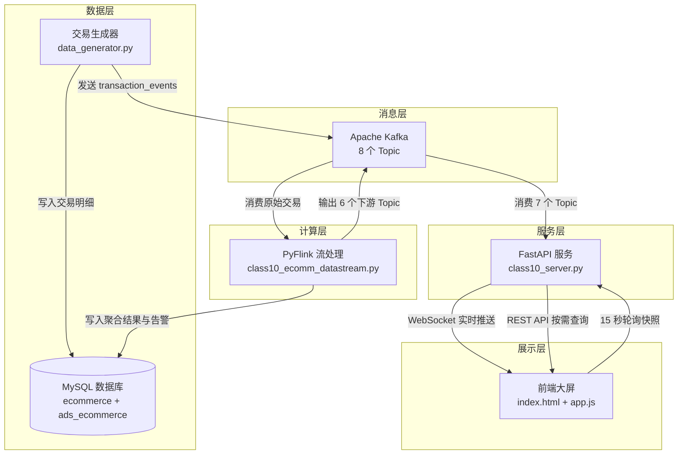
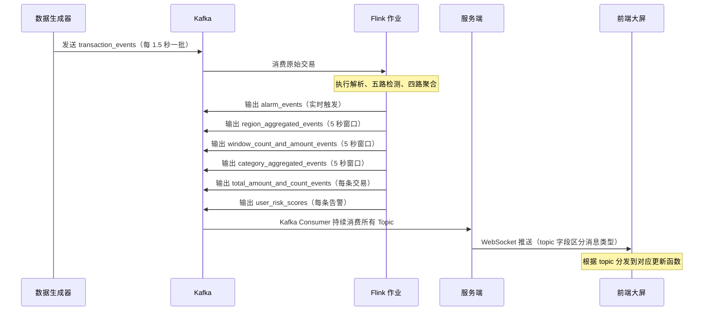
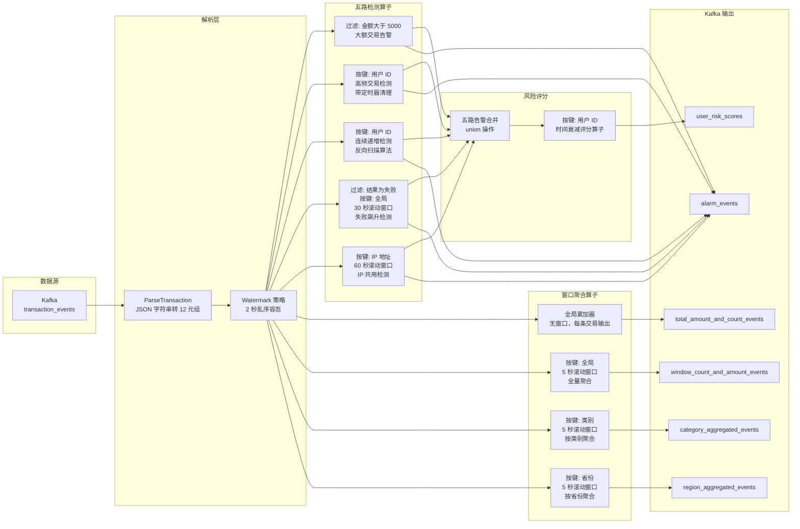
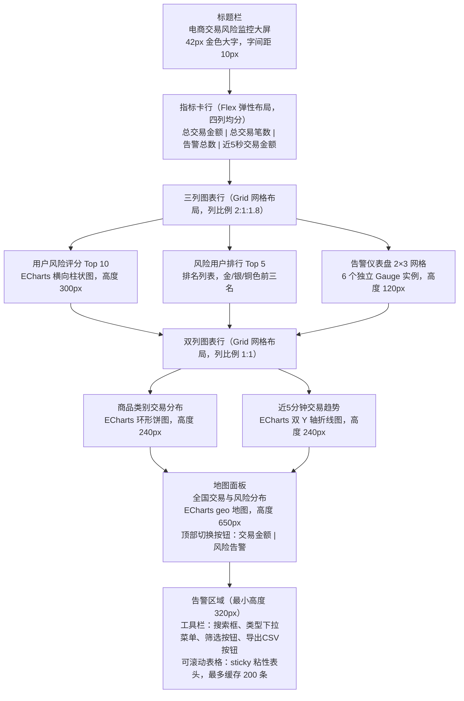

# 电商交易风险实时检测系统 — 技术文档

> **项目定位**：基于 PyFlink + Kafka + FastAPI + ECharts 的实时流处理教学演示系统，模拟电商交易场景下的多维度风险检测与大屏可视化。

---

## 一、项目概述

### 1.1 项目背景与目标

电子商务平台每天产生海量交易数据，欺诈行为隐藏在正常交易流中。常见的欺诈模式包括：

- **盗刷**：攻击者获取用户支付凭证后快速大额消费，特征是短时间内出现远高于用户历史水平的交易金额。
- **刷单**：卖家或团伙通过大量虚假交易操纵店铺评分，特征是同用户短时间内产生密集的低金额交易。
- **撞库/卡号测试**：攻击者使用自动化工具批量尝试卡号有效性，特征是高失败率的小额交易序列。
- **账号共享/团伙作案**：多个账户从同一 IP 操作，可能是黑产团伙协同行为。

传统风控依赖 T+1 批处理报表，昨天的欺诈今天才发现，损失已经发生。实时流处理将检测延迟从"天"缩短到"秒"，在欺诈行为进行中即可告警和干预。

本系统构建了一条完整的实时流处理管道，依次经过五个阶段：**模拟交易数据生成**、**Kafka 消息队列缓冲与解耦**、**Flink 流计算引擎进行风险检测与聚合**、**WebSocket 实时推送**、**大屏可视化展示**。在一张监控大屏上同时呈现交易全景与风险态势，运营人员无需切换多个系统即可掌握实时业务状况。

系统定位为教学演示项目，所有的检测阈值、评分参数、数据生成策略均可按需调整，便于理解实时风控的核心原理。虽然数据是模拟的，但技术栈和架构设计与生产系统高度一致。

### 1.2 设计理念

系统遵循三条核心设计原则贯穿始终。

**分层解耦**：数据层、消息层、计算层、服务层、展示层各自独立，层间仅通过定义明确的接口（Kafka Topic Schema、REST API Contract）通信。任一层可独立替换而不影响其他层。例如，将交易生成器替换为真实的电商日志采集器，只需保证 Kafka 消息格式一致即可；将 Flink 替换为其他流处理框架（如 Spark Streaming 或 Kafka Streams），上下游不受影响。

**渐进复杂度**：检测规则从最简单的无状态过滤（大额交易）到有状态滑动窗口（高频交易）到序列模式识别（连续递增），难度递进，覆盖了流处理中常见的状态管理模式。评分模型从固定权重演进到动态乘数，体现了从"规则"到"模型"的思维跃迁。

**可观测性优先**：所有计算结果不仅写入数据库，同时通过 Kafka 和 WebSocket 实时推送至大屏。开发者和观众可以在大屏上直接观察系统的运行状态，无需查询数据库或查看日志。这种设计使系统的行为完全透明——哪些交易触发了告警、哪些用户评分最高、哪个省份交易量最大，一目了然。

### 1.3 技术选型与理由

下表列出了各层核心技术选型及其选择理由。

| 组件 | 选型 | 理由 |
|------|------|------|
| 流处理引擎 | Apache Flink (PyFlink 1.18) | 真正的事件时间语义、有状态处理能力、毫秒级延迟，优于 Spark Streaming 的微批处理模型 |
| 消息队列 | Apache Kafka 2.12 | 高吞吐、消息持久化、发布-订阅模型天然解耦生产与消费两端 |
| Web 框架 | FastAPI + Uvicorn | 原生 WebSocket 支持、异步非阻塞 I/O、自动生成 OpenAPI 文档 |
| 实时推送 | WebSocket | 全双工长连接，单条消息延迟低于 10 毫秒，远优于 HTTP 短轮询方案 |
| 可视化 | ECharts 5.x | 原生 geo 组件支持中国地图、gauge 仪表盘类型、丰富的暗色主题定制能力 |
| 数据生成 | Faker + 自定义逻辑 | 可控的概率模型注入异常行为，同时向 MySQL 和 Kafka 双路输出 |
| 数据库 | MySQL 8.x | 双库设计（DWD 明细层 ecommerce + ADS 应用层 ads_ecommerce），模拟数据仓库分层架构 |

### 1.4 系统能力一览

**风险检测**：5 路并行检测算子覆盖大额交易、高频交易、连续递增、失败飙升、IP 共用五类欺诈模式，检出结果秒级推送大屏。

**风险评分**：基于指数时间衰减的动态评分模型，每条告警的严重性随具体指标（金额、次数）线性放大并设上界，分用户累计形成 Top 10 排行榜。

**多维聚合**：5 秒滚动窗口按全局、商品类别、省份三个维度聚合交易金额与笔数，结果双写 Kafka（供实时推送）和 MySQL（供历史查询）。

**地理可视化**：中国地图热力图支持交易金额和风险告警两种显示模式，可通过切换按钮实时切换。省份数据来自 Flink 实时聚合和 MySQL 历史查询两个来源。

**可靠性设计**：Kafka 消费者自动重连、WebSocket 断线指数退避重连、浏览器刷新后累计状态通过服务端快照恢复。

---

## 二、需求分析

### 2.1 功能需求

#### 2.1.1 交易数据模拟

系统需要在不依赖真实电商接口的条件下产生有意义的测试数据。

**用户模型**：系统维护 300 个用户，分配至 31 个中国大陆省级行政区（按人口权重加权随机），共享 30 个 IP 地址池（有限复用可触发 IP 共用检测），每个用户拥有设备指纹和账户类型（普通或 VIP）。

**商品模型**：10 个商品类别（电子、服装、食品、家居、图书、运动、玩具、健康、汽车、音乐），每类 6 到 12 个 SKU，价格区间贴合实际（例如电子产品 50 到 5000 元，食品 1 到 100 元）。

**异常注入**：每批 15 条交易中按独立概率注入三种异常。高频交易以 25% 概率注入，随机选 1 个用户连续生成 3 到 5 笔交易；连续递增以 15% 概率注入，随机选 1 到 2 个用户各生成 3 到 4 笔递增金额交易；大额交易以 25% 概率注入，生成 1 到 2 笔金额在 5000 到 20000 元之间的交易。剩余槽位填充随机生成的普通交易。

**双路输出**：交易明细同步写入 MySQL ecommerce 数据库（DWD 层持久化）和 Kafka transaction_events 主题（实时流处理入口）。

#### 2.1.2 风险检测规则

系统对每笔交易实时评估，当满足以下任一条件时生成告警。

| 编号 | 告警类型 | 触发条件 | 检测窗口 | 状态管理方式 |
|------|---------|---------|---------|-------------|
| R1 | 大额交易 | 单笔交易金额大于 5000 元 | 无窗口（逐笔判断） | 无状态 |
| R2 | 高频交易 | 同一用户 5 分钟内交易不少于 5 笔 | 5 分钟滑动窗口 | 列表状态存储时间戳，定时器清理过期记录 |
| R3 | 连续递增 | 连续不少于 3 笔金额逐笔递增，每笔增幅不低于 10% | 无窗口（序列检测） | 列表状态存储最近 10 笔金额 |
| R4 | 失败飙升 | 30 秒内失败交易不少于 8 笔 | 30 秒滚动窗口 | 窗口函数内计数 |
| R5 | IP 共用 | 60 秒内同一 IP 不少于 3 个不同用户 | 60 秒滚动窗口 | 窗口函数内去重计数 |

五条检测规则覆盖了欺诈行为的不同维度。R1（大额交易）是最直接的异常信号，无窗口设计使其延迟最低，单笔交易到达即刻判断。R2（高频交易）和 R3（连续递增）关注的是行为模式而非单点数值：高频表征自动化脚本的批量操作，递增表征攻击者在试探系统阈值后逐步加大力度的典型手法。R4（失败飙升）专门针对撞库和卡号测试场景，这些攻击的核心特征是交易失败率异常高。R5（IP 共用）则从网络层视角发现账户关联，正常用户不太可能多人共用同一 IP，但黑产团伙常通过代理或 VPN 使多个账户共享出口。

三条有状态检测规则（R2、R3、R5）的状态管理方式各不相同。R2 使用 KeyedProcessFunction 加 Timer，是因为需要在窗口内按用户粒度独立管理时间戳列表并定时清理过期记录。R3 使用 KeyedProcessFunction 但不需要 Timer，是因为仅维护最近 10 笔金额的滑动窗口，每次更新即可截断。R5 使用 ProcessWindowFunction，是因为窗口语义天然匹配"在固定时间段内收集所有元素后统一判断"的需求。这三种状态模式覆盖了 Flink 有状态流处理的核心场景。

#### 2.1.3 风险评分模型

在五路检测之上，系统维护每个用户的时间衰减风险评分，综合反映用户近期风险行为的频率和严重程度。评分每收到一条告警即更新，通过指数衰减函数使旧风险随时间减弱，新风险立即反映。模型的完整设计见第四章第 4.2.4 节。

#### 2.1.4 大屏可视化

大屏包含八个可视化区域，各自采用不同的图表类型和数据刷新策略。

| 区域 | 图表类型 | 数据刷新方式 | 刷新频率 |
|------|---------|------------|---------|
| 顶部指标卡（4 个） | 数字卡片 | WebSocket 实时推送 | 每笔交易或每 5 秒 |
| 用户风险评分 Top 10 | 横向柱状图 | 轮询为主，WebSocket 触发为辅 | 15 秒或实时触发 |
| 风险用户排行 Top 5 | 排名列表 | 轮询 | 15 秒 |
| 告警仪表盘（2×3） | 6 个 Gauge 仪表盘 | 轮询 | 15 秒 |
| 商品类别交易分布 | 环形饼图 | WebSocket 实时推送 | 约 5 秒 |
| 近 5 分钟交易趋势 | 双 Y 轴折线图 | WebSocket 实时推送 | 约 5 秒 |
| 中国地图热力图 | Geo Map 地理图 | WebSocket 实时推送加轮询 | 约 5 秒或 15 秒 |
| 实时告警列表 | 可筛选可滚动表格 | WebSocket 实时推送加 REST 查询 | 实时或手动筛选 |

#### 2.1.5 数据导出

系统支持两种数据导出功能。告警导出允许按告警类型和关键词筛选后导出为 CSV 文件，文件包含 BOM 头确保在 Microsoft Excel 中直接打开中文不乱码。统计导出允许按时间窗口范围导出交易聚合数据。

### 2.2 非功能需求

| 类别 | 需求 | 实现方式 |
|------|------|---------|
| 低延迟 | 交易到达至大屏更新不超过 2 秒 | Kafka 与 WebSocket 全链路推送，无轮询环节阻塞 |
| 状态持久化 | 浏览器刷新后累计数据不丢失 | 服务端维护累计状态，新 WebSocket 连接时发送快照 |
| 容错性 | Kafka 或 MySQL 异常时自动恢复 | Kafka 消费者无限重连循环；API 层捕获异常返回 error JSON |
| 可配置性 | 密码和路径不硬编码 | mysql_config.json 配置文件加 MYSQL_PASSWORD 等环境变量 |
| 可测试性 | 核心逻辑独立可测 | 算法与框架解耦，通过 mock 替换外部依赖即可运行测试 |

---

## 三、系统总体设计

### 3.1 分层架构

系统按数据流向自底向上分为数据层、消息层、计算层、服务层、展示层共五层。下图展示了各层的组成和层间的数据流向。

如上图所示，交易生成器同时向 MySQL 和 Kafka 写入数据。Flink 作业从 Kafka 消费原始交易，经计算后将检测告警和聚合结果写回 Kafka 和 MySQL。服务端从 Kafka 消费结果并通过 WebSocket 推送至前端，同时提供 REST API 供前端按需查询历史数据。前端大屏同时接收 WebSocket 实时推送和 REST 轮询数据，渲染各类图表。

### 3.2 数据流详解

#### 3.2.1 实时推送链路

以下时序图展示了一笔交易从生成到最终显示在大屏上的完整路径，整个过程在秒级完成。

从时序图可以看出，系统中有两条时间线并行运转。第一条是交易驱动的实时线：数据生成器每 1.5 秒发送一批交易，Flink 处理后按不同节奏输出（大额告警逐条触发、窗口聚合每 5 秒输出一次），服务端收到后立即通过 WebSocket 广播。第二条是定时轮询线：前端每 15 秒向服务端请求一次历史统计快照。

#### 3.2.2 轮询快照链路

前端每 15 秒通过单一 HTTP 请求获取四组历史统计数据，替代了早期版本中 4 个独立轮询的设计。服务端处理流程如下：

**第一步**：服务端收到 `/api/dashboard/snapshot` 请求后，打开一个 MySQL 连接。

**第二步**：在同一连接内依次执行三个查询——Top 5 风险用户排名（跨库 JOIN 或分步查询 fallback）、告警类型分布统计（按 alert_type 分组计数）、省份告警统计（关联用户表获取省份字段）。

**第三步**：关闭数据库连接，然后从内存缓存中读取 Flink 实时计算的风险评分数据，再通过 ecommerce 库查询用户名称，合并生成 Top 10 评分列表。

**第四步**：将四组数据合并为单个 JSON 对象返回前端。前端据此更新 Top 5 排行列表、风险评分柱状图、告警仪表盘和地图告警模式的数据。

这一设计将原本需 4 次 HTTP 请求和 4 次 MySQL 连接的开销，降低为 1 次 HTTP 请求和 1 次 MySQL 连接，减少了 75% 的网络往返和数据库开销。

### 3.3 数据库设计

#### 3.3.1 分层策略

系统采用数据仓库分层思想，将数据库分为两层。

| 层级 | 数据库名 | 用途 | 写入方 |
|------|---------|------|--------|
| DWD（明细层） | ecommerce | 存储维度表（用户、商品、类别）和交易事实表 | 数据生成器 |
| ADS（应用层） | ads_ecommerce | 存储窗口聚合统计和风险告警记录 | Flink 作业 |

DWD 层模拟在线交易数据库（OLTP），记录每一笔交易的原始信息。ADS 层模拟面向分析的应用数据库（OLAP），存储经过 Flink 计算后的聚合结果和检测告警。两层之间的数据流转由 Flink 作业完成。

#### 3.3.2 ecommerce 库（DWD 明细层）

该库包含四张表：一张类别字典表、一张用户信息表、一张商品信息表和一张交易事实表。

**categories 表**：商品类别字典，包含类别名称（主键）和类别描述两个字段。10 个类别在系统初始化时写入。

**users 表**：用户信息表，包含用户唯一标识（主键）、用户名、IP 地址、省份、城市、账户类型（普通/VIP）、设备信息七个字段。其中省份字段建有索引以加速按省份聚合的查询。系统初始化时创建 300 个用户，按人口权重随机分配到 31 个省级行政区，共享 30 个 IP 地址。

**products 表**：商品信息表，包含商品唯一标识（主键）、所属类别（外键指向 categories 表）、商品名称、标准单价、商品状态五个字段。系统初始化时为每个类别创建 6 到 12 个商品，价格区间根据类别特性设定。

**transactions 表**：交易事实表，是数据量最大的表，包含交易唯一标识（主键）、用户 ID（外键指向 users 表）、商品 ID（外键指向 products 表，可为空）、类别、金额、交易类型（购买/退款/转账）、交易结果（成功/失败/处理中）、业务事件时间（毫秒精度）八个字段。建有两个索引：事件时间单列索引用于时间范围查询，用户 ID 加事件时间复合索引用于按用户维度的高频检测查询。

#### 3.3.3 ads_ecommerce 库（ADS 应用层）

该库包含两张表：窗口聚合统计表和风险告警记录表。

**transaction_stats 表**：窗口聚合统计表，记录每个 5 秒滚动窗口的聚合结果。包含自增主键、窗口起始时间、窗口结束时间、类别（"ALL" 表示全局聚合）、窗口内总交易金额、窗口内交易笔数六个字段。该表建有唯一约束 `(window_start, window_end, category)`，配合 MySQL 的 `ON DUPLICATE KEY UPDATE` 语法实现 UPSERT 语义：当 Flink 因故障恢复而重新处理同一窗口时，新数据会覆盖旧数据而非产生重复行。

**risk_alerts 表**：风险告警记录表，记录 5 种检测规则产生的所有告警。包含自增告警 ID（主键）、告警类型、涉及用户 ID、触发交易 ID、涉及金额（仅大额和递增类型的告警有值）、交易次数（仅高频和失败飙升类型的告警有值）、窗口起始时间、窗口结束时间、详细信息（文本描述）、告警事件时间十个字段。建有四个索引：按告警类型、按告警时间、按用户 ID、按交易 ID，分别支持不同类型的查询场景。

### 3.4 Kafka Topic 体系

系统使用 7 个 Kafka Topic 作为组件间的数据通道。下表列出了每个 Topic 的生产者、消费者和消息内容。

| Topic 名称 | 生产者 | 消费者 | 消息主要内容 |
|-----------|--------|--------|------------|
| transaction_events | 数据生成器 | Flink 作业 | 用户 ID、金额、类别、时间戳、省份、IP 地址等 |
| alarm_events | Flink（五路检测合并） | 服务端 | 告警类型、用户 ID、金额或笔数、告警时间 |
| total_amount_and_count_events | Flink 全局累加器 | 服务端 | 累计总金额、累计总笔数 |
| window_count_and_amount_events | Flink 全局窗口函数 | 服务端 | 窗口起止时间、窗口内总金额、窗口内笔数 |
| category_aggregated_events | Flink 类别窗口函数 | 服务端 | 窗口起止时间、类别、总金额、笔数 |
| region_aggregated_events | Flink 省份窗口函数 | 服务端 | 窗口起止时间、省份、总金额、笔数 |
| user_risk_scores | Flink 风险评分算子 | 服务端 | 用户 ID、风险评分值 |

Topic 的命名遵循"数据内容加 events 后缀"的约定。所有消息以 JSON 格式传输。服务端作为几乎所有 Topic 的消费者，在单个 Kafka Consumer 中订阅全部 7 个 Topic，通过消息的 topic 字段区分来源。

---

## 四、功能模块详细设计

### 4.1 数据生成模块

数据生成器是整个系统的数据源头，负责持续产生模拟电商交易并同时写入 MySQL 和 Kafka。

#### 4.1.1 批量生成策略

生成器以批为单位运行：每 1.5 秒生成一批，每批 15 条交易，运行 10 分钟后自动停止。每批生成时按以下概率模型决定交易类型：

- **25% 概率注入高频交易**：随机挑选 1 个用户，为其连续生成 3 到 5 笔交易，所有交易时间集中在当前时刻附近，模拟自动化脚本的批量操作行为。
- **15% 概率注入连续递增交易**：随机挑选 1 到 2 个用户，为每个用户生成 3 到 4 笔金额逐笔递增的交易（每笔增幅在 10% 到 50% 之间的随机倍数），模拟攻击者在试探系统阈值后逐步加大力度的行为。已在本批次中被注入过递增交易的用户会被记录在集合中，防止同一批次重复注入。
- **25% 概率注入大额交易**：生成 1 到 2 笔金额在 5000 到 20000 元之间的交易，模拟盗刷行为的大额消费特征。
- **剩余槽位填充普通交易**：补齐至 15 条的总量。普通交易的用户和商品随机选取，金额在 10 到 3000 元之间均匀分布。

生成器内部维护两个字典用于递增交易的状态管理。`seq_states` 记录每个用户的最后一次金额和计数，确保下一笔递增交易能在前一笔基础上增加。`seq_committed` 记录本批次已处理过的用户集合，防止同一批次内对同一用户重复注入递增序列。

#### 4.1.2 双路输出机制

每批交易生成后同时向两个目标写入。

**MySQL 写入**：采用批量 INSERT 语句（executemany）写入 transactions 表。如果因主键冲突导致批量写入失败，则回退到逐条重试模式，跳过冲突的交易，打印警告但继续运行。当数据库连接断开时，通过 ping 函数检测并自动重连，最多尝试 3 次，每次间隔 2 秒。

**Kafka 写入**：逐条异步发送到 transaction_events 主题，每条消息包含 12 个字段：交易 ID、用户 ID、商品 ID、类别、金额、交易类型、交易结果、IP 地址、商品名称、省份、城市、时间戳（毫秒级 epoch）。批次内所有消息发送完毕后调用 flush 确保完整送达。

#### 4.1.3 元数据刷新

生成器每处理 100 个批次（约 2.5 分钟）执行一次元数据刷新，从 MySQL 重新加载用户列表、商品列表和省份城市信息。这确保如果在运行期间通过外部手段添加了新用户或商品，生成器能及时发现并使用。

### 4.2 Flink 流处理模块

这是系统的核心计算层。Flink 作业从 Kafka 消费原始交易数据（JSON 字符串格式），经过解析转换为内部数据结构，然后分叉为 11 条并行处理链路：5 条用于风险检测、3 条用于窗口聚合、1 条用于全局累加、1 条用于风险评分、1 条用于商品聚合（已移除，见第七章问题记录）。

#### 4.2.1 作业拓扑结构

下图以 Mermaid 流程图展示了 Flink 作业的完整 DAG（有向无环图）拓扑。数据从左侧 Kafka Source 流入，经过 ParseTransaction 解析节点后分发到五条检测链路（Detection）、四条聚合链路（Aggregation）和一条评分链路（Scoring），最终汇聚到右侧的 Kafka Sink 节点输出。

从上图可以清晰看出系统的数据分叉和汇聚逻辑：一条原始交易流进入后，被 ParseTransaction 解析为统一格式，然后复制到 9 个下游算子并行处理。五条检测链路的输出通过 union 操作合并为一条告警流，再送入风险评分算子。四条聚合链路各自独立输出到不同的 Kafka Topic。

#### 4.2.2 数据解析层

**ParseTransaction 算子**：这是一个 MapFunction，负责将 Kafka 中的 JSON 字符串转换为 12 元组结构，作为所有下游算子的统一输入格式。

元组中的 12 个字段按固定顺序排列：用户 ID（位置 0）、金额（位置 1，浮点数）、类别（位置 2）、时间戳（位置 3，整数，毫秒 epoch）、交易 ID（位置 4）、交易结果（位置 5）、交易类型（位置 6）、IP 地址（位置 7）、商品 ID（位置 8）、商品名称（位置 9）、省份（位置 10）、城市（位置 11）。

对于 JSON 中的必填字段（用户 ID、金额、时间戳、交易 ID），如果缺失会导致解析异常并抛出错误。对于可选字段（类别、IP 地址、省份、城市等），如果缺失则使用预设默认值填充，例如类别默认为 "unknown"，IP 地址默认为 "0.0.0.0"，省份和城市默认为 "未知"。这种"必填严格、选填宽容"的设计确保数据管道不会因个别字段缺失而整体中断。

为解决 12 元组的可读性问题，项目中定义了一组模块级常量（T_IDX_USER_ID 到 T_IDX_CITY），分别对应每个字段的索引位置。下游所有使用元组索引的地方（包括 key_by 的键选择器、filter 的条件表达式、窗口函数内的字段提取）均使用这些常量而非裸数字。当元组结构需要调整时，只需修改常量定义和 ParseTransaction 的返回语句即可。

**时间语义与 Watermark**：系统使用 TransactionTimestampAssigner 从元组的第 4 个字段（时间戳）提取事件时间，配置 BoundedOutOfOrderness Watermark 策略，允许 2 秒的乱序容忍度。这意味着如果一条交易的时间戳比当前已见的最大时间戳早 2 秒以上，它将被视为迟到数据而丢弃。在当前的模拟数据场景中（数据生成器按时间顺序发送），乱序几乎不会发生，但保留此配置使系统在真实环境中具有更好的适应性。

#### 4.2.3 五路检测算子

以下逐一说明每种检测算子的类型选择、状态管理和处理逻辑。

##### (1) 大额交易检测

**算子类型**：MapFunction，无状态。

这是最简单的检测规则。算子通过 filter 操作筛选出金额超过阈值（5000 元）的交易，然后由 MapFunction 构造告警消息。告警消息包含告警类型、用户 ID、交易 ID、金额、类别、告警时间、详细信息描述等字段。

由于不需要跨交易的状态信息，该算子无需维护任何 Flink 状态。MySQL 持久化在 MapFunction 内部完成：在 open 阶段建立数据库连接，在 map 方法的末尾将告警写入 risk_alerts 表，在 close 阶段释放连接。

##### (2) 高频交易检测

**算子类型**：KeyedProcessFunction，按用户 ID 分组，使用列表状态加定时器。

该算子需要追踪每个用户在过去 5 分钟内的所有交易时间戳，以此判断是否达到高频阈值（5 笔）。状态使用列表类型存储毫秒级 epoch 时间戳。

处理流程分为两个阶段。在 process_element 阶段：首先从状态中读取该用户的历史时间戳列表；然后计算 5 分钟前的时间边界（当前时间戳减去 300000 毫秒），过滤掉所有早于该边界的记录；接着将当前时间戳追加到列表中；注册一个定时器在当前时间戳加 300000 毫秒后触发，用于到时清理过期记录；如果列表长度达到或超过 5，立即输出告警。在 on_timer 阶段：再次读取时间戳列表，过滤掉已过期的记录，将清理后的列表写回状态，不输出任何数据（返回空列表）。

设计要点：定时器机制确保长期不活跃用户的状态最终会被清理，防止状态无限增长。第 5 笔交易到达时立即触发告警，不等待滑动窗口自然关闭，实现实时检出。on_timer 方法必须显式返回空列表，不能返回 Python 的 None 值，否则 PyFlink 会将其视为异常抛出 TimerException。

##### (3) 连续递增检测

**算子类型**：KeyedProcessFunction，按用户 ID 分组，使用列表状态。

该算子追踪每个用户最近 10 笔交易的金额序列，检测是否存在连续不少于 3 笔的严格递增模式（每笔增幅不低于 10%）。

处理流程：从状态中读取历史金额列表；将当前金额追加到列表末尾；如果列表长度超过 10，截断保留最近 10 笔；如果列表长度达到最低检测门槛（3 笔），执行反向扫描算法。反向扫描从最新金额开始，向列表头部方向逐个比较，检查每个金额是否不小于前一个金额的 1.1 倍。如果满足条件则递增计数器加一，如果不满足则扫描中断。当递增计数器达到或超过 3 时，输出告警并清空状态，防止同一递增序列触发多次告警。

下表展示了一个具体的检测实例，以交易序列 100 元、120 元、95 元、150 元、200 元为例：

| 交易序号 | 当前金额 | 历史金额列表 | 扫描过程与结果 |
|---------|---------|------------|--------------|
| 第 1 笔 | 100 | [100] | 列表长度不足 3，不检测 |
| 第 2 笔 | 120 | [100, 120] | 列表长度不足 3，不检测 |
| 第 3 笔 | 95 | [100, 120, 95] | 从 95 开始扫描：95 不低于 120 的 1.1 倍（132），扫描中断，不触发 |
| 第 4 笔 | 150 | [100, 120, 95, 150] | 从 150 开始扫描：150 不低于 95 的 1.1 倍（104.5），继续；95 不低于 120 的 1.1 倍（132），中断。仅计 2 笔，不触发 |
| 第 5 笔 | 200 | [100, 120, 95, 150, 200] | 从 200 开始扫描：200 不低于 150 的 1.1 倍（165），继续；150 不低于 95 的 1.1 倍（104.5），继续；95 不低于 120 的 1.1 倍（132），中断。计 3 笔，**触发告警** |

##### (4) 失败交易飙升检测

**算子类型**：ProcessWindowFunction，30 秒滚动窗口，按全局固定键分组。

该算子的上游通过 filter 操作筛选出所有结果为"failed"的交易，然后统一键控到同一个全局键上，进入 30 秒的滚动窗口。窗口关闭时，算子统计窗口内收集到的失败交易总数，如果达到或超过阈值（8 笔），则输出告警。告警的用户 ID 字段固定为 "GLOBAL"，表示这是一个系统级告警而非针对特定用户。

##### (5) IP 共用检测

**算子类型**：ProcessWindowFunction，60 秒滚动窗口，按 IP 地址分组。

该算子按交易的 IP 地址字段进行分组，同一 IP 的所有交易进入 60 秒滚动窗口。窗口关闭时，算子遍历窗口内的所有交易元素，提取每个交易的用户 ID 并放入集合去重。如果去重后的用户数量达到或超过阈值（3 个），说明该 IP 在 1 分钟内有多个不同用户同时活跃，输出告警。告警消息中额外包含 IP 地址、共享用户数量和共享用户列表字段。

#### 4.2.4 时间衰减风险评分模型

这是本项目模型设计的核心部分。在五路规则检测产生离散告警事件的基础上，该模型为每个用户维护一个连续的风险评分，综合反映其近期风险行为的频率和严重程度，用以回答"谁是最危险的用户"这一问题。

##### 模型设计动机

五路检测各自独立工作，产出的是离散的告警事件。但实际业务需要将这些事件整合为一个可比较的量化指标。具体而言需要解决三个问题。第一，跨类型整合：大额交易和高频交易的风险性质不同（一个是金额异常，一个是频率异常），需要一个统一的度量框架将它们量化到同一尺度上。第二，时间敏感性：1 分钟前的高频交易比昨天的大额交易更值得关注，评分必须反映风险的时效性。第三，严重性区分：同样是触发大额交易规则，一笔 50000 元的交易比一笔 5001 元的交易更可疑；同样是高频交易，20 笔比刚好 5 笔更可疑，评分必须能够区分触发阈值边缘和远超阈值的不同程度。

##### 模型的两层架构

评分模型由两个函数层级组成。

**第一层：严重性函数**。将单条告警映射为一个严重性分数，公式为：

$$\text{严重性} = w_{\text{基础}} \times m_{\text{动态}}$$

其中，$w_{\text{基础}}$ 为基础权重，反映告警类型的相对严重性，不同告警类型有不同的预设值。$m_{\text{动态}}$ 为动态乘数，基于该条告警的具体指标值（如金额大小、交易笔数）计算，使严重性能够随异常程度线性放大。

**第二层：时间衰减累加函数**。将新告警的严重性分数按指数衰减后累加到用户的历史评分上，公式为：

$$R_{\text{新}} = R_{\text{旧}} \times e^{-\lambda \cdot \Delta t} + \text{严重性}(a_{\text{新}})$$

其中，$R_{\text{旧}}$ 为用户上次告警触发后的评分值，$\Delta t$ 为距离上次告警的时间差（毫秒），$\lambda$ 为衰减系数。

##### 参数推导

衰减系数 $\lambda$ 由半衰期参数 $T_{1/2}$ 推导而来，关系为 $\lambda = \ln(2) / T_{1/2}$。系统将半衰期设为 3 分钟（180000 毫秒），这是基于演示场景（10 分钟）做出的选择：前 3 分钟的用户行为逐步积累评分，后 7 分钟旧行为的影响逐步消退，评分变化曲线在 10 分钟的演示窗口内肉眼可观察到明显的起伏。

| 参数 | 设定值 | 含义与推导 |
|------|--------|----------|
| 半衰期 | 180000 毫秒（3 分钟） | 每过 3 分钟，旧评分衰减为原来的一半 |
| 衰减系数 | $\ln(2) / 180000 \approx 3.85 \times 10^{-6}$ | 代入衰减公式计算每个时间间隔的衰减比例 |
| 衰减行为示例 | $\Delta t = 3$ 分钟时 $R_{\text{旧}} \times 0.5$ | 恰好 1 个半衰期，旧分减半；6 个半衰期（18 分钟）后旧分降至 1.6% 以下 |

##### 基础权重配置

不同告警类型的基础权重反映了其相对危害程度。

| 告警类型 | 基础权重 | 设计依据 |
|----------|---------|---------|
| 大额交易 | 0.30 | 直接造成资金损失，单笔危害最大 |
| 高频交易 | 0.25 | 高频操作通常表征自动化攻击工具 |
| 连续递增 | 0.20 | 试探性递增是欺诈前奏，但单笔金额通常不高 |
| 失败飙升 | 0.25 | 批量失败是撞库和卡号测试的典型特征 |
| IP 共用 | 0.25 | 多账户共用出口 IP 是团伙作案的常见模式 |
| 未知类型（默认） | 0.10 | 兜底值，确保未识别的告警类型也能参与评分 |

##### 动态乘数函数

动态乘数 $m_{\text{动态}}$ 每种告警类型独立定义，将具体的业务指标值映射为 1.0 到上界之间的乘数。乘数公式采用"实际值除以阈值"的线性缩放，并用最小值函数封顶。

| 告警类型 | 使用的指标 | 阈值 | 乘数上限 | 乘数计算公式 |
|----------|----------|------|---------|------------|
| 大额交易 | 交易金额 | 5000 元 | 5 倍 | 金额除以 5000，不超过 5.0 |
| 高频交易 | 交易笔数 | 5 笔 | 4 倍 | 笔数除以 5，不超过 4.0 |
| 连续递增 | 递增长度 | 3 笔 | 4 倍 | 长度除以 3，不超过 4.0 |
| 失败飙升 | 失败笔数 | 8 笔 | 5 倍 | 笔数除以 8，不超过 5.0 |
| IP 共用 | 共用用户数 | 3 个 | 5 倍 | 用户数除以 3，不超过 5.0 |

为保证防御性，所有乘数都有一层下界保护：即使指标值为 0 或缺失（异常数据），乘数也不会低于 1.0，确保用户至少获得基础权重。完整的乘数计算逻辑为：取指标值除以阈值的商，用上限值钳制高位，再用 1.0 钳制低位。

下表以具体数值演示了乘数计算过程：

| 场景描述 | 指标数值 | 乘数计算过程 | 最终严重性 |
|---------|---------|------------|----------|
| 刚好触发大额阈值 | 金额 = 5000 元 | 5000 除以 5000 = 1.0 | 0.30 × 1.0 = **0.30** |
| 大额 5 倍阈值（触及上限） | 金额 = 25000 元 | 25000 除以 5000 = 5.0（触及上限） | 0.30 × 5.0 = **1.50** |
| 高频 2 倍阈值 | 笔数 = 10 | 10 除以 5 = 2.0 | 0.25 × 2.0 = **0.50** |
| 失败飙升 5 倍阈值（触及上限） | 笔数 = 40 | 40 除以 8 = 5.0（触及上限） | 0.25 × 5.0 = **1.25** |
| 未知告警类型 | 无指标 | 使用默认乘数 1.0 | 0.10 × 1.0 = **0.10** |

##### 处理流程

当一条告警到达评分算子时，执行以下步骤：

**步骤一**：解析告警 JSON，提取告警类型和各项业务指标。

**步骤二**：调用严重性计算函数，根据告警类型和指标值算出本次告警的严重性分数。

**步骤三**：解析告警时间。优先从告警消息的 alert_time 字段读取（ISO 8601 格式，转换为毫秒 epoch）。如果该字段缺失或格式无法解析，回退使用 Flink 的处理时间（ctx.timestamp()）。两种来源均为毫秒 epoch，保持一致性。

**步骤四**：从状态中读取该用户的上次评分记录。状态以字符串格式存储，内容为"评分值,时间戳"。如果用户此前没有评分的记录，则评分初始为 0，时间戳初始为 0。

**步骤五**：如果存在历史评分且当前时间晚于上次记录时间，对旧评分施加时间衰减：旧评分乘以 e 的负 lambda 乘时间差次方。如果不存在历史评分（新用户），跳过此步。

**步骤六**：将衰减后的旧评分与本次告警的严重性相加，得到新评分。

**步骤七**：将新评分和当前时间戳以"评分值,时间戳"的字符串格式写回状态。

**步骤八**：如果新评分大于 0.001，将评分结果（包含用户 ID、风险评分值、更新时间）以 JSON 格式输出到下游 Kafka Topic。

##### 状态存储方案选择

评分状态使用 Flink 的 ValueState 存储，数据类型为 String。状态内容是一个以逗号分隔的字符串，格式为"评分值,时间戳"。选择字符串而非 PyFlink 复合类型（如 Tuple2）的原因是：PyFlink 对复合类型的序列化在不同运行模式（本地调试模式与集群模式）下表现不一致，可能因序列化器不匹配导致作业启动失败。字符串方案在所有模式下行为一致，且当前系统并行度为 1，不存在分布式一致性方面的额外要求。

##### 模型特性总结

时间衰减风险评分模型具有四个关键特性。**时间局部性**：半衰期机制使旧风险随时间指数衰减，1 个半衰期后权重减半，6 个半衰期（18 分钟）后降至 1.6% 以下，模型自然倾向于近期行为。**严重性区分**：动态乘数使 50000 元交易的评分贡献是 5000 元交易的 5 倍，区分"刚好触发"和"远超阈值"。**跨类型可比**：不同告警类型通过归一化参数映射到同一评分空间，可以直接比较。**上界控制**：乘数封顶防止单次极度异常（如 100 万元的交易或 100 个用户共享 IP）主导评分，确保模型的稳定性。

#### 4.2.5 窗口聚合算子

系统包含四个聚合算子，它们从不同维度对交易流进行 5 秒滚动窗口的聚合统计。

**全局累加器**是一个特殊的聚合算子：它不使用窗口，而是维护内部累加器（总金额和总笔数两个变量），每条交易到达时立即更新并输出当前累计值。这是大屏顶部"实时总交易金额"和"实时总交易笔数"两个指标卡的数据源。因为该算子是 MapFunction 而非窗口函数，它的输出延迟最低——每笔交易处理完成即输出。

**全局窗口函数**按固定的全局键对所有交易进行 5 秒滚动窗口聚合，结果是"近 5 秒窗口金额"指标卡和趋势折线图的数据源。每次窗口关闭时，聚合结果同时写入 Kafka（供实时推送）和 MySQL（使用 UPSERT 语法防止故障恢复时产生重复记录）。

**类别窗口函数**按商品类别字段进行键控分组，在 5 秒滚动窗口内聚合每个类别的交易总额和笔数。这是类别饼图的数据源，前端用此数据展示各类别在当前窗口内的交易额占比。

**省份窗口函数**按省份字段进行键控分组，在 5 秒滚动窗口内聚合每个省份的交易总额和笔数。这是中国地图热力图在"交易金额"模式下的数据源。

三个窗口函数的内部聚合逻辑相同：遍历窗口内的所有交易元素，累加每笔交易的金额字段得到总额，对交易元素计数得到总笔数，最终输出包含窗口起止时间、键值、总金额、总笔数的 JSON 消息。

### 4.3 Web 服务模块

Web 服务是整个系统的数据中枢，承担三个职责：消费 Kafka 中的计算结果并通过 WebSocket 实时推送到前端、提供 REST API 供前端查询历史数据和导出文件、维护服务端累计状态以支持浏览器刷新后的数据恢复。

#### 4.3.1 Kafka 消费者线程

服务端在后台运行一个独立的 Kafka 消费者线程。该线程同时订阅全部 7 个 Topic，逐条消费消息并完成三项工作。

**第一项**，将消息通过 WebSocket 广播给所有已连接的客户端。由于 WebSocket 发送是异步操作，消费者线程通过 asyncio 的跨线程调度机制（run_coroutine_threadsafe）将消息安全地传递给主事件循环，不会阻塞 Kafka 的消费进度。

**第二项**，更新服务端的累计状态。当收到全局累加器发来的消息时，更新服务端记录的累计交易总额和累计交易笔数；当收到告警消息时，将告警计数加一。这些累计值用于新客户端连接时发送状态快照，解决浏览器刷新后数据丢失的问题。

**第三项**，更新内存缓存。当收到省份聚合消息时，更新省份交易数据缓存（以锁保护并发访问）；当收到风险评分消息时，更新用户评分缓存（同样以锁保护）。这些缓存使 REST API 能够在不查询数据库的情况下立即返回最新的实时数据。

**容错设计**：整个消费逻辑包裹在一个无限循环中。如果 Kafka 连接断开或消费过程抛出任何异常，线程会关闭当前消费者（如果已创建）、记录警告日志、等待 5 秒，然后重新进入循环创建新的消费者。这确保了即使 Kafka broker 重启，服务也能自动恢复数据消费。

#### 4.3.2 REST API 端点一览

服务端提供 11 个 REST API 端点，按功能可分为四类。下表列出了所有端点的路径、参数和数据来源。

| 端点路径 | 请求参数 | 数据来源 | 功能说明 |
|---------|---------|---------|---------|
| /api/categories | 无 | MySQL ecommerce 库 | 返回 10 个商品类别字典 |
| /api/alerts/history | alert_type（可选）, keyword（可选）, limit（可选，默认 500） | MySQL ads_ecommerce 库 | 返回告警历史列表，支持按类型和关键词筛选 |
| /api/alerts/stats | 无 | MySQL ads_ecommerce 库 | 返回告警类型分布和近 24 小时按小时统计 |
| /api/top-risky-users | limit（可选，默认 5） | MySQL 跨库 JOIN | 返回告警次数最多的 Top N 用户 |
| /api/dashboard/snapshot | 无 | MySQL 加内存缓存 | 合并返回 Top5、风险评分、告警统计、省份告警四组数据 |
| /api/region-stats | 无 | 内存缓存 | 返回各省份实时交易金额和笔数 |
| /api/region-alert-stats | 无 | MySQL 跨库 JOIN | 返回各省份历史告警数量 |
| /api/user-risk-scores | limit（可选，默认 10） | 内存缓存加 MySQL JOIN | 返回 Flink 实时计算的 Top N 用户风险评分 |
| /api/export/alerts | alert_type（可选）, keyword（可选） | MySQL ads_ecommerce 库 | 导出告警为 CSV 文件（BOM 加 UTF-8） |
| /api/export/stats | window_start（可选）, window_end（可选） | MySQL ads_ecommerce 库 | 导出窗口统计为 CSV 文件 |
| /api/stats/history | window_start（可选）, window_end（可选） | MySQL ads_ecommerce 库 | 返回历史窗口聚合统计数据 |

**接口合并设计**：/api/dashboard/snapshot 端点是后期优化的产物。在早期版本中，前端需要分别调用四个独立接口来获取 Top 5 排行、风险评分、告警统计和省份告警数据，每 15 秒产生 4 次 HTTP 请求和 4 次 MySQL 连接。合并后的单次请求在一个 MySQL 连接内依次完成三个查询（Top 5、告警分布、省份告警），再从内存缓存读取风险评分，将四个结果打包为一个 JSON 对象返回。底层查询逻辑通过四个辅助函数复用，单个接口（如 /api/top-risky-users）和合并接口（/api/dashboard/snapshot）调用同一份代码，消除了重复。

#### 4.3.3 状态快照机制

浏览器刷新会导致 WebSocket 断开重连，前端内存中的累计变量（总金额、总笔数、告警总数）归零。为解决这个问题，服务端在 Kafka 消费者线程中持续追踪累计值。当新的 WebSocket 客户端连接成功后，服务端立即发送一条特殊格式的快照消息，其中包含四个部分的数据：当前累计交易总额、当前累计交易笔数、当前累计告警总数、当前省份交易数据（从内存缓存中读取）。

前端在 WebSocket 的 onmessage 处理器中识别快照消息，调用恢复函数将指标卡数值更新为服务端记录的累计值，并将省份缓存数据填充到地图的待渲染队列中。同时，前端在页面加载时调用 /api/dashboard/snapshot 接口获取历史统计数据（Top 5 排行、告警分布、省份告警等），这些数据不需要"累计"，本身就是从数据库查询的全量结果。

这一机制的效果是：无论何时刷新浏览器，指标卡的数字在 WebSocket 连接建立后的几十毫秒内即可恢复到刷新前的水平，无需等待新的交易数据逐步重新积累。

### 4.4 前端大屏模块

前端由三个文件组成：index.html（页面结构，119 行）、app.js（业务逻辑与图表渲染，548 行）、style.css（样式定义，170 行），合计约 838 行。大屏的核心设计目标是"一眼看清全貌"——在同一页面内同时呈现交易全景、风险态势、地理分布和时间趋势，运营人员无需任何操作即可持续监控。

#### 4.4.1 页面布局

大屏采用垂直流式布局，自上而下分为标题区、指标卡区、三列图表区、双列图表区、地图区、告警列表区共六个区域。各区域之间通过 CSS Grid 和 Flexbox 组合编排，页面整体可滚动以适配不同分辨率的投影设备（最低适配 1366×768 分辨率）。

以下 Mermaid 流程图展示了大屏的层级结构，从上到下依次为六个区域的嵌套关系。

各区域的比例设计各有考量。三列行采用 2:1:1.8 的非对称比例是因为：风险评分榜作为核心分析工具需要足够宽度展示 10 个用户的排名和分数值，Top 5 排行信息密度低给最小空间即可，仪表盘 6 个图表需要适中空间容纳 2×3 的网格。双列行采用 1:1 对称比例是因为饼图和趋势图重要性相当。地图高度设为 650px 是因为中国地图需要足够的纵向空间来展示 31 个省级行政区的色阶差异——高度不足会导致省份挤在一起无法辨认。告警列表最小高度 320px 确保至少展示约 10 行记录，同时 sticky 表头保证滚动时列名始终可见。

#### 4.4.2 配色方案

大屏采用"水墨丹青"中国风暗色主题，以低亮度深色背景衬托高亮度数据内容，适合长时间盯着屏幕的风控运营场景。

| 颜色名称 | 十六进制色值 | 应用于 |
|---------|------------|--------|
| 墨色 | #0B1525 | 页面整体背景 |
| 黛蓝 | rgba(26, 58, 92, 0.82) | 所有卡片和面板的半透明背景 |
| 琉璃黄 | #D4A037 | 大屏标题、指标卡数值、高风险等级元素 |
| 朱砂红 | #D45252 | 大额交易告警类型的专属颜色 |
| 青花蓝 | #2B7BE4 | 趋势折线图的金额线、筛选按钮、一般信息元素 |
| 月白 | #D6E4F0 | 正文文字和图表的坐标轴标签 |

六种颜色各有固定用途，形成一致的视觉语言。同一告警类型在表格行、仪表盘和统计图中使用相同的颜色编码，降低用户的认知负担。

#### 4.4.3 数据刷新机制

前端的数据获取遵循"WebSocket 优先、轮询补充"的原则。WebSocket 连接建立后，大屏绝大多数区域的更新都由服务端主动推送驱动，只有历史统计数据通过定时轮询获取。

**WebSocket 实时推送**：服务端通过 7 种消息类型向所有连接的客户端广播数据。前端在 onmessage 处理器中根据消息的 topic 字段进行路由分发。全局累计消息更新总金额和总笔数指标卡；窗口全量消息追加趋势图数据点（最多保留 60 条，约 5 分钟）并更新窗口金额指标卡；类别聚合计消息更新饼图数据；省份聚合消息更新地图的"交易金额"模式数据；告警消息追加到告警列表顶部（最多保留 200 条）并递增告警计数器；风险评分消息触发一次评分数据的拉取刷新（5 秒内去重，避免短时间内多次刷新）。每种消息类型驱动对应的图表更新函数，函数内部调用 ECharts 的 setOption 方法实现图表的增量或全量刷新。

**定时轮询**：每 15 秒执行一次快照请求，单次 HTTP 调用获取 Top 5 排行、风险评分榜、告警仪表盘数据、省份告警数据（供地图的"风险告警"模式使用）四组数据。轮询结果分别调用对应的渲染函数更新图表。

**WebSocket 断线重连**：当 WebSocket 连接因网络波动或服务重启而断开时，前端采用指数退避策略自动重连。重连延迟从 1 秒起步，每次失败翻倍（1 秒、2 秒、4 秒、8 秒……），直到最大上限 30 秒。一旦某次连接成功，延迟重置为 1 秒。这种策略在网络短暂抖动时能快速恢复，在服务长时间不可用时又不会以固定高频不断冲击服务端。

#### 4.4.4 中国地图双模式切换

中国地图是唯一一个支持数据源切换的图表，通过地图工具栏上的两个按钮在"交易金额"和"风险告警"两种模式之间切换。

**金额模式**（默认）：数据来自 WebSocket 实时推送的省份聚合消息（region_aggregated_events），数据存储在 regionMap 中。每次收到新消息即更新对应省份的金额值并重新渲染地图。热力图色阶从深蓝（低金额）经浅蓝过渡到金色再到红色（高金额）。鼠标悬停在省份上时，提示框显示该省份的名称和当前累计交易金额（格式化为人民币元）。

**告警模式**：数据来自每 15 秒轮询拉取的省份告警统计（/api/region-alert-stats 或 dashboard/snapshot），数据存储在 regionAlertMap 中。色阶采用紫色到红色的渐变，与金额模式的蓝金色阶形成视觉区分，用户切换后能立即感知到显示内容的变化。提示框显示省份名称和告警次数。

两种模式共享同一个 ECharts 实例，切换时只需改变数据源和色阶配置，无需重新初始化地图或重新加载 GeoJSON 地理数据。按钮采用分段式设计，当前激活的模式以高亮蓝色边框和文字标识。

---

## 五、设计原则与代码框架

### 5.1 分层解耦

项目严格遵循五层架构，各层之间仅通过 Kafka Topic 或定义明确的 REST/WebSocket 接口通信。这种设计的核心价值在于各层可以独立开发、独立测试、独立替换。数据层的交易生成器可以替换为真实电商日志采集器，只需保证发往 Kafka 的消息格式一致。计算层的 Flink 作业可以替换为 Spark Streaming 或 Kafka Streams 实现，上下游完全不受影响。展示层可以整体更换 UI 框架（如从原生 ECharts 迁移到 Grafana），只要 API 契约不变即可。

### 5.2 状态管理原则

状态管理是本系统设计的核心挑战之一，因为同一个用户的交易分布在不同的时间点到达，系统需要在多个层面维护状态以实现跨时间的计算。

#### 5.2.1 Flink 层面的有状态计算

Flink 的三种算子各自采用不同的状态管理模式，覆盖了流处理中最常见的场景。

| 算子名称 | 状态类型 | 存储内容 | 状态清理机制 |
|---------|---------|---------|------------|
| 高频交易检测器 | 列表状态（时间戳数组） | 当前 5 分钟窗口内的所有交易时间戳 | 每条交易过滤过期记录，定时器定期清理 |
| 连续递增检测器 | 列表状态（浮点数数组） | 用户最近 10 笔交易的金额 | 自动截断保留最新 10 笔，告警触发后立即清空 |
| 时间衰减评分器 | 值状态（字符串） | 评分和时间戳的字符串对 | 每次更新直接覆盖旧值，无需手动清理 |

#### 5.2.2 服务端层面的内存缓存

服务端维护两组内存缓存。省份交易数据缓存（region_cache）和用户评分缓存（risk_score_cache）均由 Kafka 消费者线程实时更新，使用 Python 标准库的 threading.Lock 保护并发访问。累计状态变量（总金额、总笔数、告警总数）同样由消费者线程更新，用于新客户端快照。服务重启后内存缓存全部丢失，但 MySQL 中保有全量的历史数据，不影响历史查询功能。

#### 5.2.3 前端层面的响应式状态

前端使用多个 JavaScript Map 和数组维护图表所需的数据。类别数据、省份数据、趋势数据、告警列表各自独立存储。每个数据结构都有容量上限：趋势数据最多保留 60 个数据点（约 5 分钟的窗口），告警列表最多缓存 200 条记录，防止长时间运行导致浏览器内存膨胀。告警列表的筛选功能通过一个布尔标志位隔离实时数据和历史查询：筛选激活时，WebSocket 推送的实时告警仍然正常在后台累积，但表格渲染的是服务器返回的筛选结果；清除筛选后，表格恢复显示后台累积的实时数据。

### 5.3 幂等性与一致性

#### 5.3.1 数据库层面的 UPSERT 设计

transaction_stats 聚合表使用窗口起止时间和类别的组合作为唯一约束。当 Flink 因故障恢复而重复处理同一窗口的数据时，MySQL 的 ON DUPLICATE KEY UPDATE 机制会用新值覆盖旧值，而不是插入重复行。这是实现"至少一次"语义下幂等写入的标准方案。

#### 5.3.2 告警记录的天然去重能力

告警表以自增 ID 为主键，每次 INSERT 都生成新行，因此 Flink 故障重放会导致同一告警被写入多次。但每条告警记录都包含告警时间、用户 ID、告警类型和详细信息字段，前端或下游系统可以通过（用户 ID、告警类型、告警时间）的三元组来识别和去除短时间窗口内的重复告警。

#### 5.3.3 Kafka Offset 管理策略

所有消费者使用自动偏移提交，从最新位置开始消费。这实际上是"至多一次"的语义：优先保障低延迟，容忍在故障场景下的少量数据丢失。对于教学演示系统来说，重启后从最新数据开始是合理的选择，避免了积压数据的追赶延迟。

### 5.4 配置管理

系统将敏感配置与代码分离。数据库连接参数存储在独立的 JSON 配置文件（mysql_config.json）中，由统一的配置加载模块（config_loader.py）读取和分发。密码支持环境变量覆盖（MYSQL_PASSWORD），使得同一个配置文件可以在不同环境中使用而不暴露真实密码。Flink 运行环境相关的路径通过三个环境变量（PYFLINK_VENV、PYFLINK_JARS_DIR、PYFLINK_PYTHON_EXEC）控制，各自有 Windows 环境下的默认回退值，确保在开发机上可以直接运行。

### 5.5 测试设计原则

测试设计遵循"算法与框架分离"的原则。核心计算逻辑（评分函数、数据解析、检测算法）设计为纯函数或最小依赖的形式，可以在不启动 Flink Runtime、不连接 MySQL、不接入 Kafka 的条件下直接实例化 Python 对象并调用。集成测试使用 Python 标准库的 mock 模块替换外部依赖（如 pymysql.connect 被替换为返回预设数据的虚拟连接、Kafka 消费者线程的启动被替换为空操作），通过 FastAPI 的 TestClient 在内存中发送 HTTP 请求并验证响应。全部 49 条用例在 1.2 秒内完成，不依赖任何外部服务。

---

## 六、测试方案

### 6.1 测试分层策略

系统的测试分为三个层次，各层关注不同的风险点。

**L1 层 —— 算法单元测试**（25 条用例）：测试范围包括风险评分的严重性计算函数、时间衰减状态机、连续递增检测算法、交易数据解析逻辑和配置加载逻辑。这些测试不依赖任何外部服务，直接实例化 Python 对象并验证输入输出。例如，严重性计算函数接收一个告警字典作为输入，返回一个浮点数作为输出，测试用例只需构造不同的字典（正常值、边界值、缺失字段）并断言返回值是否在预期的误差范围内。时间衰减状态机的测试则通过 mock 对象模拟 Flink 的 ValueState 和 Context 接口，在纯 Python 环境下验证衰减公式的正确性和状态持久化行为。

**L2 层 —— 集成测试**（24 条用例）：测试范围包括全部 REST API 端点和数据库查询辅助函数。使用 FastAPI 的 TestClient 发送 HTTP 请求，验证 HTTP 状态码和 JSON 响应结构。pymysql 的数据库连接函数在测试中被全局替换为返回预设数据的虚拟连接，不需要真实的 MySQL 服务。API 测试不仅验证"接口返回了什么数据"，还通过捕获 mock cursor 上 execute 方法的调用参数来验证"接口是否正确地将筛选条件传递到了 SQL 查询中"。

**L3 层 —— 手工验证**：Flink 作业的 DAG 拓扑正确性、WebSocket 的双向通信、ECharts 图表的渲染效果需要启动完整的管道（生成器、Flink、服务端、浏览器）进行手工验证。

| 验证场景 | 验证步骤 | 预期结果 |
|---------|---------|---------|
| Flink DAG 拓扑 | 启动生成器和 Flink 作业，打开 Flink Dashboard | 全部算子状态为 RUNNING |
| 检测规则生效 | 运行生成器 2 分钟后查询 risk_alerts 表 | 5 种告警类型均有记录 |
| 大屏实时推送 | 浏览器打开 http://localhost:8000 | 指标卡数字持续增长，图表实时刷新 |
| 刷新数据恢复 | 浏览器按 F5 刷新页面 | 指标卡数值恢复到刷新前水平 |
| CSV 导出可用 | 点击导出按钮 | 浏览器下载 .csv 文件，Excel 正常打开 |

### 6.2 测试覆盖总览

| 测试文件 | 层级 | 用例数 | 覆盖目标 |
|---------|------|--------|---------|
| test_risk_scorer.py | L1 | 8 | 严重性计算：全 5 种告警类型、乘数封顶、零值保护、缺失字段 |
| test_risk_scorer_process.py | L1 | 5 | 状态机：首条告警、累加、时间衰减、极小值过滤、时间戳回退 |
| test_increase_detector.py | L1 | 5 | 递增检测：触发、不触发、中断、状态清空、部分匹配 |
| test_parse_transaction.py | L1 | 4 | 数据解析：完整 JSON、最小 JSON、金额类型、时间戳类型 |
| test_config.py | L1 | 3 | 配置加载：JSON 读取、环境变量覆盖、默认字符集 |
| test_server_api.py | L2 | 17 | 全 9 类 REST 端点、SQL 参数透传验证、CSV 导出、错误降级 |
| test_server_queries.py | L2 | 7 | 辅助查询函数：JOIN 成功与 fallback、空结果、缓存排序 |
| **合计** | | **49** | **全部通过，总耗时 1.2 秒** |

### 6.3 关键测试用例分析

**动态乘数上界验证**：test_large_amount_capped 用例验证当大额交易金额达到 5 倍阈值（25000 元）时，乘数被正确限制在 5.0 上界，最终严重性为 0.30 乘以 5.0 等于 1.50。这个测试确保评分模型不会被单笔极端大额交易主导。

**下界保护验证**：test_large_amount_zero_still_gets_base_weight 用例验证当告警数据出现异常值（金额字段为 0）时，max 钳位保护生效，用户仍然获得 0.30 的基础权重而非 0。这是防御性编程的典型用例，确保系统不因异常输入产生无意义输出。

**时间衰减数学验证**：test_delay_causes_decay 用例模拟了两条间隔恰好 3 分钟（1 个半衰期）的大额告警。第一条告警使评分达到 0.30，3 分钟后该评分恰好衰减一半为 0.15，再叠加第二条告警的新增严重性 0.30，最终评分应在 0.44 到 0.46 之间。该测试直接验证了指数衰减公式的实现正确性。

**SQL 参数透传验证**：test_filter_by_type_passes_param_to_sql 和 test_filter_by_keyword_passes_like_to_sql 是白盒测试的典型案例。它们不仅检查 HTTP 状态码，还通过访问 mock cursor 的 execute 调用参数来断言 SQL 字符串中确实包含了正确的参数化查询条件。这种测试确保筛选参数被正确拼接到 SQL 中，而不仅仅是"接口返回了数据"。

**错误降级验证**：test_db_error_returns_error_json 验证当数据库连接失败（pymysql.connect 抛出异常）时，端点返回 HTTP 200 加 JSON 错误对象，而非 500 Internal Server Error。这确保前端可以根据 error 字段优雅地显示"查询失败"提示，而非整个页面崩溃。

### 6.4 未覆盖场景说明

以下场景因 mock 成本过高而留待手工验证，不做自动化测试。Flink 作业的完整 DAG 执行需要本地 Flink 集群、Kafka broker 和 MySQL 数据库全栈运行，mock 整个 RuntimeContext、TimerService 和 WatermarkStrategy 体系会使测试失去对实际运行正确性的验证意义。WebSocket 的双向通信和 Kafka 消费者线程的跨线程调度涉及真实的异步 I/O 和线程切换行为，单元测试难以有效复现。ECharts 图表的 DOM 渲染效果属于 UI 自动化测试范畴，需要使用 Playwright 或 Puppeteer 等无头浏览器工具进行截图对比，超出了本项目当前的技术范围。

---

## 七、问题记录与项目总结

### 7.1 开发过程关键问题

开发过程中遇到的每个问题都折射出流处理系统设计中的一般性挑战。下表记录了 7 个影响较大的问题及其根因分析。

| 序号 | 问题描述 | 造成的影响 | 根本原因 | 解决方案 | 可复用的教训 |
|------|---------|----------|---------|---------|------------|
| 1 | Flink on_timer 返回 None 导致 TimerException | 高频交易检测完全失效 | PyFlink 要求 on_timer 方法显式返回可迭代对象，Python 函数默认隐式返回的 None 被视为异常 | 所有 on_timer 方法统一显式返回空列表 | Flink Python API 的类型约定比 Java API 更严格，隐式返回值是常见陷阱 |
| 2 | 省份名称与 GeoJSON 数据不匹配 | 中国地图热力图始终无数据 | 代码中使用简称（如"广东"），GeoJSON 文件使用全称（"广东省"） | 将 31 个省份的键名全部改为全称格式 | 依赖外部数据源时，必须在数据流的每个环节验证名称规范的一致性 |
| 3 | 风险评分字典遗漏失败飙升类型 | 失败飙升告警始终以默认权重 0.10 参与评分，与预期不符 | 权重字典定义时遗漏了 FAILED_SURGE 类型的条目 | 补全五种告警类型的权重，同时重构为动态乘数模型 | 枚举型配置的完整性需要自动化检查，字典键集合与枚举值集合的一致性应尽早验证 |
| 4 | 浏览器刷新后大屏数据全部归零 | 演示体验差，刷新后需要等待数分钟重新积累数据 | 累计值仅存储在前端 JavaScript 变量中，刷新即清空 | 服务端跟踪累计状态，新 WebSocket 连接时推送快照 | 前端适合展示"当前状态"，但状态的真实来源应设在服务端 |
| 5 | Kafka 消费者线程静默崩溃后无法恢复 | 实时推送完全中断 | except 异常处理块中调用 consumer.close() 时，consumer 变量在构造函数抛异常的情况下尚未被赋值，引发 NameError 退出重连循环 | 在 try 块之前将 consumer 初始化为 None，except 块中加入空值判断 | 异常处理代码本身也可能引入新异常，finally 或 except 块中使用的变量必须在所有执行路径上确保已初始化 |
| 6 | 前端 4 个独立轮询产生冗余请求 | 每 15 秒产生 4 次 HTTP 请求和 4 次 MySQL 连接 | 各图表的轮询逻辑独立实现，未考虑合并 | 服务端新增合并端点，将 4 组数据打包为单次响应 | API 设计应随前端需求变化持续演进，合并频繁调用的小接口是最直接的性能优化 |
| 7 | Flink 文件中残留 FastAPI 代码 | 57 行死代码使维护者困惑哪个文件才是 Web 服务入口 | 早期版本在 Flink 作业文件中内嵌 Web 服务器，后来拆分为独立文件但未清理原文件 | 删除无用的 import 语句和路由定义 | 代码清理和功能开发同等重要，应及时移除废弃路径而非保留以防万一 |

### 7.2 架构设计反思

回顾整个开发过程，有几个设计选择被证明是项目的关键决策。

**五路检测的并行设计**：将 5 种检测规则实现为独立的 Flink 算子，通过 union 操作合并告警流，是正确且必要的选择。每条规则的检测逻辑、状态管理机制和窗口配置完全不同，拆分使各算子可以独立调试参数和排查问题。假如当初设计为单个巨大的 ProcessFunction 包含所有检测分支，任何参数的调整都可能牵一发而动全身，问题定位也将困难得多。

**从固定权重到动态乘数的演进**：初版评分模型使用固定权重，每种告警类型一个常数。实际运行中发现这一设计无法区分"刚好触发阈值"和"远超阈值"的告警——5000 元的大额交易和 50000 元的大额交易在固定权重下被视为同等风险。动态乘数通过将"超出程度"映射为线性缩放（并用上界防止极端值主导），使评分模型从"分类"升级为"量化"。这一改进虽然增加了模型复杂度，但显著提升了评分的区分度和业务解释性。

**快照机制的引入时机**：浏览器的刷新行为在最初设计中被完全忽略，直到实际演示时才发现指标全部清零的问题。解决思路很简单——服务端记录加连接时推送——但它揭示了大屏系统的一个一般性原则：前端展示层应该是无状态的薄层，状态的权威来源应该在后端。这个原则在系统设计初期就确立，可以避免大量后期返工。

### 7.3 代码量统计

| 模块 | 文件名 | 代码行数 |
|------|--------|---------|
| 数据库初始化 | create_tables.py | 341 |
| 数据生成器 | data_generator.py | 321 |
| Flink 流处理 | class10_ecomm_datastream.py | 743 |
| Web 服务 | class10_server.py | 533 |
| 配置加载 | config_loader.py | 25 |
| 前端页面结构 | index.html | 119 |
| 前端业务逻辑 | app.js | 548 |
| 前端样式 | style.css | 170 |
| 数据库配置 | mysql_config.json | 7 |
| 测试代码 | 7 个测试文件 | 约 500 |
| **总计** | | **约 3307 行** |

### 7.4 后续优化方向

**MySQL 连接池**：当前每个 API 请求都新建数据库连接，适合低并发的演示场景。在面向多用户的部署中应使用 SQLAlchemy 等 ORM 框架的连接池管理，减少连接握手的开销。

**Flink 状态后端升级**：当前使用内存状态后端且未启用 Checkpoint 机制，作业重启后所有 Flink 状态丢失。生产环境应切换至 RocksDB 状态后端并将 Checkpoint 持久化到 HDFS 或 S3。

**容器化部署**：当前依赖 Windows 本地路径和手动启动的中间件服务。使用 Docker Compose 编排 Zookeeper、Kafka、MySQL、Flink JobManager 和 TaskManager、Web Server 的全部组件，可实现单命令启动整个管道。

**前端自动化测试**：使用 Playwright 或 Puppeteer 等无头浏览器工具，对 ECharts 图表的渲染结果进行截图对比和像素级回归测试，将手工验证的 UI 检查步骤自动化。

**WebSocket 消息压缩**：在大数据量场景下，可启用 WebSocket 的 per-message deflate 扩展或采用 Protocol Buffers 替代 JSON 序列化，减少网络带宽消耗。
